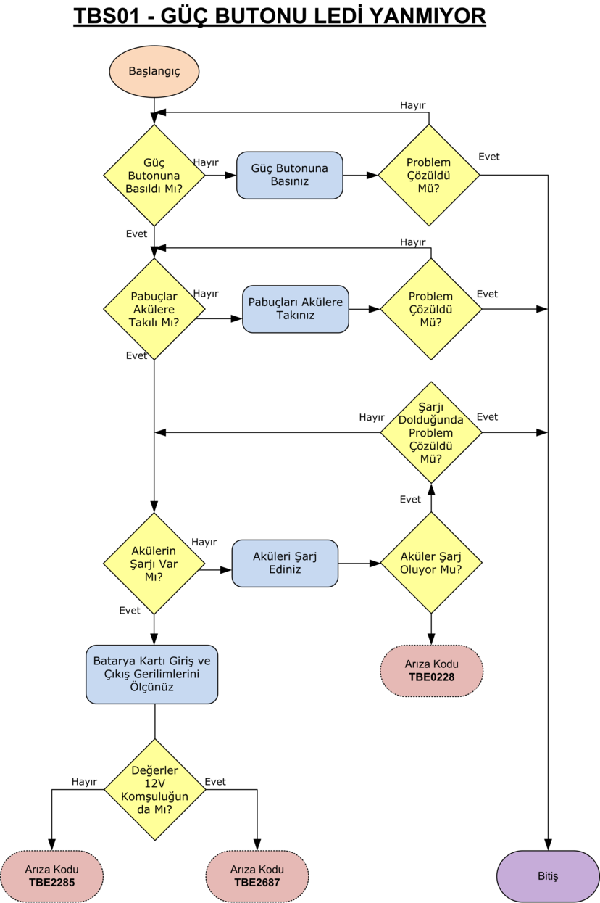
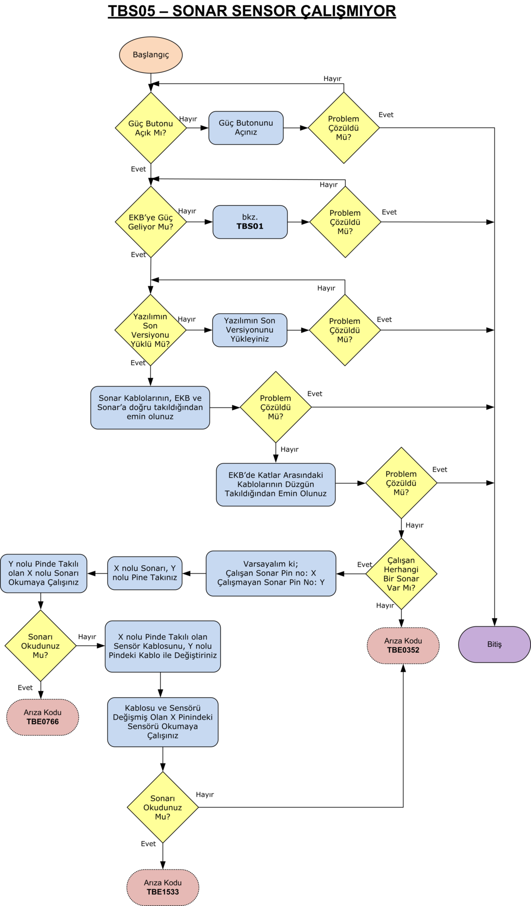
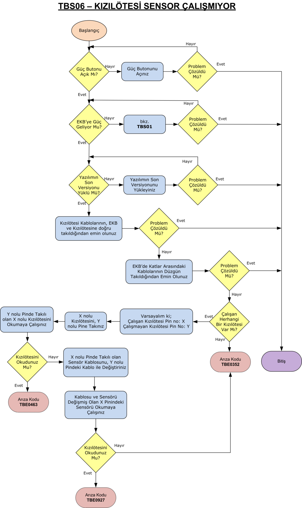
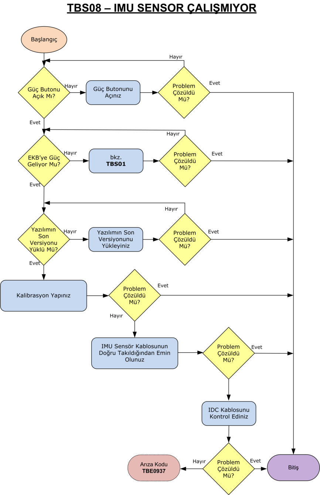

Evarobot Arıza Tespiti
``````````````````````

Evarobot arıza tespiti için yapılması gerekenlerden bahsedilecektir.
Aşağıdaki hatalardan biri veya birkaçı karşılaşılması durumunda karşılaşılan soruna ait akış diyagramının gerçekleştirilmesi gerekmektedir.
Sorunun çözülmemesi durumunda karşılaşılan arıza kodu ve log klasörünü iletişim ve taranmış fatura bilgileri ile birlikte destek@evarobot.com adresine gönderiniz.
Log dosyasının nasıl oluşturulacağı Evarobot Arıza->Evarobot Arıza Klavuzları->TTL03 Log Alma kısmında anlatılmaktadır.

TBS01 Güç Butonu Ledi Yanmıyor
~~~~~~~~~~~~~~~~~~~~~~~~~~~~~~


   
TBS02 Modeme Bağlanamıyorum
~~~~~~~~~~~~~~~~~~~~~~~~~~~


   
TBS03 SSH ile Robota Bağlanamıyorum
~~~~~~~~~~~~~~~~~~~~~~~~~~~~~~~~~~~

.. figure:: _static/ariza/TBS03_SSHileRobotaBaglanamiyorum.png
   :align: center
   :figclass: align-centered
   
TBS04 HDMI ile Robota Bağlanamıyorum
~~~~~~~~~~~~~~~~~~~~~~~~~~~~~~~~~~~~


   
TBS05 Sonar Sensor Çalışmıyor
~~~~~~~~~~~~~~~~~~~~~~~~~~~~~


   
TBS06 Kızılötesi Sensor Çalışmıyor
~~~~~~~~~~~~~~~~~~~~~~~~~~~~~~~~~~


   
TBS07 Bumper Sensor Çalışmıyor
~~~~~~~~~~~~~~~~~~~~~~~~~~~~~~


   
TBS08 IMU Sensor Çalışmıyor
~~~~~~~~~~~~~~~~~~~~~~~~~~~


   
TBS09 Lidar Sensor Çalışmıyor
~~~~~~~~~~~~~~~~~~~~~~~~~~~~~


   
TBS10 Lazer Sensor Çalışmıyor
~~~~~~~~~~~~~~~~~~~~~~~~~~~~~


   
TBS11 3D Sensör Çalışmıyor
~~~~~~~~~~~~~~~~~~~~~~~~~~


