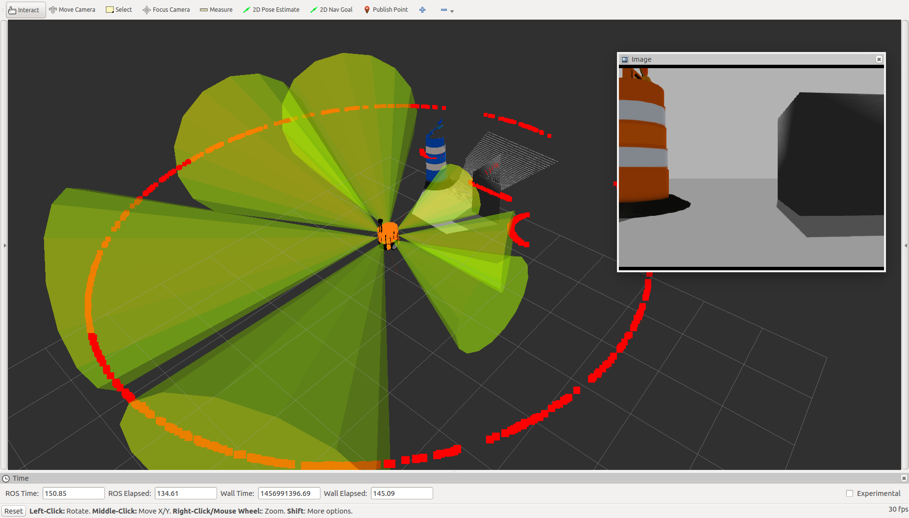

Benzetim Ortamı
===============

Evarobot Gazebo Modeli Tanıtımı
-------------------------------
Bu kısımda evarobot gazebo modelinin çalıştırılması ve sensörlerin kullanmaası anlatılmaktadır.
Evarobot'u Gazebo'da çalıştırmak için aşağıdaki gibi launch dosyasını kullanabilirsiniz.

::

	> roslaunch evarobot_description evarobot.launch

Varsayılan model üzerinde kullanılan sensörler; - Bumper x3 - Kızılötesi x4 - Sonar x7 - Kinect x1 - Lidar x1

Model üzerindeki sensör sayılarını ve konumlarını evarobot_description/urdf klasörü içindeki .urdf dosyalarını kullanarak değiştirebilirsiniz.

Simulasyonu çalıştırdıktan sonra aşağıdaki komutu kullanarak, topikleri listeleyebilirsiniz.

::

	> rostopic list

info komutu ile <topic_ismi> yerine yazılacak topik hakkında bilgi edibilirsiniz.

::

	> rostopic info /<topic_ismi>

Robot üzerindeki sensörleri rviz ile görselleştirilebilmektedir. Aşağıdaki gibi rviz açılabilir.

::

	> rosrun rviz rviz

Sol menüdeki 'Add' butonu kullanılarak robot modeli veya sensörler eklenerek görselleştirmeler yapılır. 

Robot modelini eklemek için 'Add' butonuna tıkladıktan sonra 'By display type' sekmesinde robotmodel seçilir. Koordinat dönüşümlerinde hata almamak için 'Fixed Frame' odom seçilmelidir.

Sensörleri eklemek için Add->By Topic sekmesi yolu izlendiğinde yayınlanan sensör topiği seçilir. Bütün sensörler eklendiğinde resimdeki gibi bir çıktı alınabilir. 

   
   
   
Gazebo'da Evarobot ile SLAM
---------------------------
Bu kısımda gmapping ve hector_slam kullanarak Gazebo'da SLAM harita oluşturma anlatılmaktadır.   
SLAM yapabilmek için hector_slam ros paketi ve evarobot simulator paketi indirilir ve derlenir.

::

	> cd ~/catkin_ws/src
	> git clone https://github.com/tu-darmstadt-ros-pkg/hector_slam
	> git clone https://github.com/inomuh/evarobot_simulator.git
	> cd ~/catkin_ws
	> catkin_make

SLAM yapmaya başlamadan önce açılması gereken bir kaç düğüm bulunmaktadır. 
İlk olarak Evarobot gazebo modelini açalım. Örneğimizde SLAM yapacağımız harita UPlat.sdf haritasıdır. 
Kendi haritanız isim ve yoluna göre world_path isimli argümanda değişiklik yapmalısınız.

::

	> roslaunch evarobot_gazebo evarobot.launch world_path:=$(rospack find evarobot_gazebo)/worlds/UPlat.sdf

SLAM yapmamız için gerekli olan düğümleri çalıştıran gazebo_slam.launch dosyasını açalım. gazebo_slam.launch dosyası hector_slam'in parametrelerini ayarlarak çalıştırmaktadır.

::

	> roslaunch evarobot_slam gazebo_slam.launch

Ayrıca rviz'i açarak görselleştirme yapmak için;

::

	> roslaunch evarobot_viz view_evarobot.launch

İyi bir konumlandırma için SLAM yaparken evarobot'u klavye ile sürerek haritanın tamamının kaydedilmesini sağlamamız gerekmektedir. 
Bunun için aşağıdaki kod ile klavye ile kontrol düğümünü açıyoruz.

::

	> rosrun teleop_twist_keyboard teleop_twist_keyboard.py

Tüm ortamın haritasını çıkarma işlemi tamamlandıktan sonra haritayı konumlandırma düğümlerinde kullanmak için kaydetmemiz gerekmektedir. 
map_saver düğümü ile evarobot_slam/gazebo_map klasörü altına kaydediyoruz.

::

	> rosrun map_server map_saver -f $(rospack find evarobot_slam)/gazebo_map/map

Böylece ortamın haritasını hector_slam paketini kullanarak çıkarmış olduk. 
Bir sonraki kısımda bu haritayı kullanarak Evarobot'un otonom hareket etmesine değineceğiz.

.. raw:: html

	<iframe width="700" height="393" src="https://www.youtube.com/embed/F8yZC05mLHY" frameborder="0" allowfullscreen>
	</iframe>
   
   
Gazebo'da Evarobot Navigasyonu
------------------------------
Bu kısımda çıkartılmış harita üzerinden Gazebo'da otonom evarobot navigasyonu anlarılmaktadır.   
Evarobot'u otonom hareket ettirmek için önceden ortamın haritasını çıkarmış olmanız gerekmektedir.
Gazebo simülasyon ortamında, Evarobot'un otonom navigasyonu için aşağıdaki kodu terminalde çalıştırmanız yeterli olacaktır. 
Çalıştırılan launch dosyası; 

- Argüman olarak aldığı dünya içerisinde Evarobot ile birlikte gazebo'yu, 

- Daha önceden kaydedilen haritayı, 

- amcl isimli konumlandırma düğümünü, 

- global ve lokal planlayıcıyı içeren move_base.launch dosyasını, 

- rviz'i çalıştırmaktadır.

::

	> roslaunch evarobot_navigation gazebo_navigation.launch world_path:=$(rospack find evarobot_description)/worlds/UPlat.sdf

evarobot'a otonom gitmesini istediğiniz noktayı bu örnek için rviz üzerinden verebilirsiniz. 
Bunun için rviz'de '2D Nav Goal' ile harita üzerinde işaretlemeniz yeterli olacaktır. 
rviz'i kullanmadan kendi yazacağınız düğüm ile hedef konumları evarobot'a vererek otonom hareket ettirebilirsiniz. 
Hedefleri move_base'e vermek için "/move_base/goal" isimli topikten hedef konum basmanız yeterli olacaktır.

Örnek uygulamayı videodan takip edebilirsiniz. 

.. raw:: html

	<iframe width="700" height="393" src="https://www.youtube.com/embed/d3kUAwNtQPo" frameborder="0" allowfullscreen>
	</iframe>   
   
   
   
