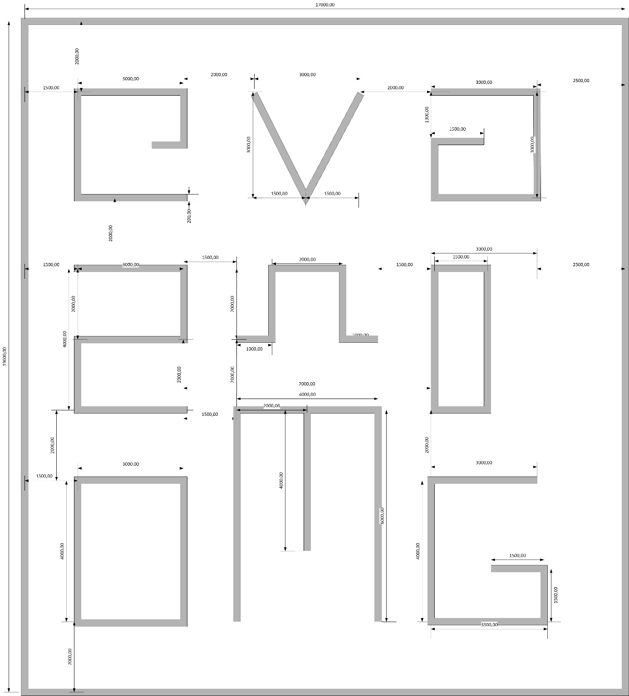
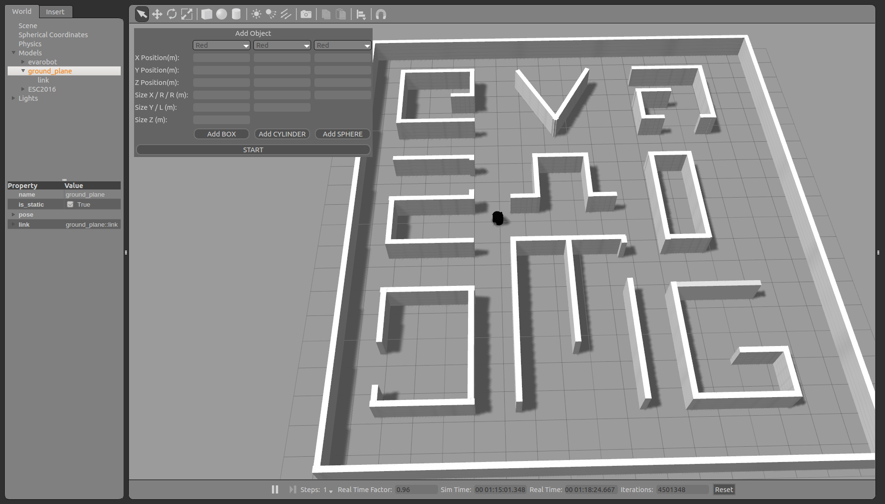
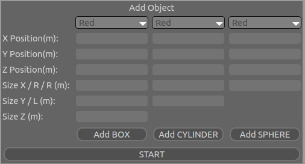

Gezgin Robot Nesne Bulma Yarışması
==================================

Bu kısımda Gezgin Robot Nesne Bulma Yarışmasına ait bilgiler verilmektedir.

29 Eylül – 01 Ekim 2016 tarihlerinde Eskişehir Osmangazi Üniversitesinde düzenlenecek olan 
Otomatik Kontrol Ulusal Toplantısı (TOK2016) sırasında gezgin robotlara yönelik simülasyon 
yarışması düzenlenecektir. Benzetim ortamı olarak `Gazebo5 <http://gazebosim.org/>`_ kullanılacaktır.

Amaç
````

Yarışma kapsamında ortama kırmızı, yeşil ve mavi renklerde 5’er tane olmak üzere toplam 15 tane nesne saklanacaktır. 
Bu nesnelerin büyüklükleri 0.1-0.25m arasında ve küp, silindir ya da küre şeklinde olacaktır. 
Yarışmadaki amaç bu nesneleri en kısa sürede bulmaktır. 


Simülasyon Ortamı
`````````````````

Yarışma sırasında simülasyonun çalışacağı ortam sunucu bilgisayarda çalışacak şekilde katılımcılara sunulacaktır. 
Katılımcılar geliştirdikleri kontrol yazılımlarını kendi bilgisayarlarında çalıştıracaklardır. 
Simülasyon ortamının çalışacağı sunucu ile katılımcıların bilgisayarları ethernet üzerinden haberleşecektir. 
Bu haberleşmenin detaylarına ‘Kılavuzlar’ başlığının altından ulaşabilirsiniz. 
Sunucu üzerinde işletim sistemi olarak `Ubuntu 14.04.01 <http://www.ubuntu.com/>`_ yüklüdür. Ayrıca `robot işletim sistemi (ROS) <http://www.ros.org/>`_’nin Jade versiyonu çalışacaktır. 
Simülasyon ortamı olarak ise `Gazebo5 <http://gazebosim.org/>`_ bulunmaktadır. Katılımcıların geliştirdikleri kontrol yazılımını test etmeleri için 
yarışmada sırasında sunucuda çalışacak olan simülasyon ortamı `github <https://github.com/inomuh/>`_ üzerinden erişilebilmektedir. Kurulum ve nasıl 
çalıştırılacağın hakkındaki bilgilere sırasıyla ‘Kurulum’ ve ‘Kılavuzlar’ başlıkları altından erişilebilmektedir.


Evarobot Hakkında
`````````````````

Yarışmada kullanılacak olan gezgin robot platformu evarobot’tur. 
Robotun özellikleri ve yarışma sırasında üzerinde takılı olacak olan sensorlar adetleri ile birlikte 
aşağıdaki tablolarda paylaşılmıştır. Robotun kullanımı hakkında daha detaylı bilgilere `http://docs.evarobot.com/ <http://docs.evarobot.com/>`_
ve `http://wiki.ros.org/Robots/evarobot/tr <http://wiki.ros.org/Robots/evarobot/tr>`_ adreslerinden ulaşabilirsiniz.

Robot platformuna ait bilgiler aşağıdaki tabloda gösterilmektedir.

========================= ==========================================
Özellik                     Değer
========================= ==========================================
En x Boy x Yükseklik		335x425x760mm
Yerden Yükseklik			55mm
Ağırlık(Batarya Dahil)		13kg
Sürüş						Diferansiyel, 2 Sürüş, 2 Sarhoş
Maksimum Hız				1.0m/s
Sürücü Tekerler				170mm, Dolma Teker
========================= ==========================================

Robot üzerinde yer alan sensörler ve sayıları değiştirilebilmektedir.
Aşağıdaki tabloda bir sensör konfigürasyonu gösterilmektedir.

====================== ============================================
Sensör İsmi            Adet	X Marka/Model
====================== ============================================
Sonar					7 X IM-SMO20
Kızılötesi				7 X Sharp GP2YOA21YK
Bumper					3 X IM-BMP10
Derinlik Kamerası		1 X Microsoft Kinect
Lidar					1 X RPLidar 360
====================== ============================================


Harita
``````

Yarışma sırasında kullanılacak ortam haritasının ölçülendirilmiş hali aşağıdaki gibidir. 
Bu ortamın simülasyon için hazırlanan sdf uzantılı dosyaya yazılımda 
`evarobot_gazebo/worlds/ESC2016.sdf <https://github.com/inomuh/evarobot_simulator/blob/jade-devel/evarobot_gazebo/worlds/ESC2016.sdf>`_
yolu izlenerek ulaşılabilir. Yarışmada robot 0,0 konumunda -90.0 derecelik bir oryantasyonda başlatılacaktır.







Kurallar
````````

* **Yarışmada evarobot gezgin robot platformu kullanılacaktır.**
* **Yarışma Gazebo benzetim ortamında düzenlenecektir.**
* **Gazebo benzetim ortamı, yarışmada sağlanacak sunucu bilgisayar üzerinde çalışacaktır.**
* **Takımlar en fazla 3’er kişilik gruplardan oluşabilecektir.**
* **Nesnelerin bulunması için verilecek süre 20dk’dır.**
* **Her ekip için 2 adet 20dk’lık deneme hakkı verilecektir.**
* **Belirlenen sürede(20dk) doğru tespit edilen nesne sayılarına göre sıralama yapılacaktır.**
* **Eşit sayıda nesne tespiti yapan gruplar tespit sürelerine göre sıralanacaktır.**
* **Yarışmada her katılımcıya aynı ortam ve nesneler verilecektir.**
* **Yarışmadan önce katılımcıların bilgisayarları toplanacaktır ve yarışma sırasında değişiklik yapılamayacaktır.**
* **Robot üzerinde değişiklik yapılamayacaktır.**
* **Nesneler küp, silindir veya küre şeklinde olacaktır.**
* **Nesnelerin renkleri kırmızı, yeşil veya mavi olacaktır.**
* **Her bir renkten 5'er tane olmak üzere toplam 15 nesne ortama saklanacaktır.**
* **Ortama yerleştirilecek olan nesnelerin büyüklükleri 0.1m - 0.25m arasında olacaktır.**
* **Nesnelerin konumu katılımcılar ile paylaşılmayacaktır.**
* **Yarışmada kullanılacak olan harita katılımcılar ile paylaşılacaktır.**
* **Haritanın büyüklüğü 17x19m olacaktır.**
* **Bulunan nesnenin konumu, nesnenin büyüklüğünün 0.75 katı içerisinde ise doğru kabul edilecektir.**
* **Robotun nesneye yakınlığı 5m den fazla ise kabul edilmeyecektir.**
* **Duvarların yüksekliği 1.0m olacaktır.**
* **SLAM ile çıkartılmış harita sunucu tarafından yayınlanmayacaktır. İsteyen katılımcılar kendileri oluşturup kullanabileceklerdir.**
* **Yarışmada sırasında sunucuda çalışacak yazılım github üzerinden paylaşılacaktır.**
* **Katılımcılar robotun kontrolünü istedikleri yazılım platformu ile kontrol edebilirler. ROS ya da MATLAB’ı kullanmaları tavsiye edilmektedir.**
* **İnovasyon Mühendislik kurallarda ve ödüllerde değişiklik yapma hakkına sahiptir.**


Kurulum
```````

UBUNTU 14.04.01 Kurulumu
~~~~~~~~~~~~~~~~~~~~~~~~

Sunucuda çalışacak olan işletim sistemi Ubuntu 14.04.01’dir. Kurulum dosyası ve kurulum ile ilgili bilgileri `http://www.ubuntu.com/ <http://www.ubuntu.com/>`_ adresinde bulabilirsiniz.

ROS JADE Kurulumu
~~~~~~~~~~~~~~~~~

ROS Jade kurulumuna `linkten <http://wiki.ros.org/jade/Installation/Ubuntu>`_ ulaşabilirsiniz. 

::

	> sudo sh -c 'echo "deb http://packages.ros.org/ros/ubuntu $(lsb_release -sc) main" > /etc/apt/sources.list.d/ros-latest.list'
	> sudo apt-key adv --keyserver hkp://ha.pool.sks-keyservers.net:80 --recv-key 0xB01FA116
	> sudo apt-get update
	> sudo apt-get install ros-jade-desktop-full
	> sudo rosdep init
	> rosdep update
	> echo "source /opt/ros/jade/setup.bash" >> ~/.bashrc
	> source ~/.bashrc

GAZEBO5 Kurulumu
~~~~~~~~~~~~~~~~

Gazebo5 kurulumuna `linkten <http://gazebosim.org/tutorials?cat=install&tut=install_ubuntu&ver=5.0>`_ erişebilirsiniz.

::

	> wget -O /tmp/gazebo5_install.sh http://osrf-distributions.s3.amazonaws.com/gazebo/gazebo5_install.sh; 
	> sudo sh /tmp/gazebo5_install.sh

EVAROBOT Yazılımlarının Kurulumu
~~~~~~~~~~~~~~~~~~~~~~~~~~~~~~~~

::

	> wget http://packages.osrfoundation.org/gazebo.key -O - | sudo apt-key add –
	> sudo apt-get update; sudo apt-get install libignition-math-dev
	> cd ~/catkin_ws/src
	> git clone https://github.com/ros-simulation/gazebo_ros_pkgs.git -b jade-devel
	> git clone https://github.com/inomuh/evapc_ros.git -b jade-devel
	> git clone https://github.com/inomuh/im_msgs.git -b jade-devel
	> git clone https://github.com/inomuh/evarobot_simulator.git -b jade-devel
	> cd ~/catkin_ws
	> catkin_make


Kılavuzlar
``````````

Benzetim Ortamının Açılması
~~~~~~~~~~~~~~~~~~~~~~~~~~~

Yarışmada kullanılacak olan harita ve robot simülasyonunu çalıştırmak için ilgili komut aşağıdadır. Bu yazılım yarışma sırasında sunucu bilgisayarda çalışacaktır.

::

	> roslaunch evarobot_gazebo evarobot_competition.launch
	
evarobot_competition bulunan nesnelerin doğruluğunu kontrol eden ros paketidir. Çalıştırmak için aşağıdaki komut kullanılmaktadır. Bu paket de yarışma sırasında sunucu bilgisayar üzerinde çalışacaktır. 

::

	> roslaunch evarobot_competition evarobot_competition.launch
	
Bu iki komut da katılımcıların yarışmadan önce geliştirdikleri yazılımı test etmeleri sağlamak amacıyla paylaşılmaktadır. 

Ortama Nesne Eklenmesi
~~~~~~~~~~~~~~~~~~~~~~

evarobot simülasyon programı çalıştırıldığında aşağıdaki gibi bir ortam ve sol üst köşede ‘Add Object’ isimli bir pencere 
açılmaktadır. Katılımcılar yazılımlarını test etmek için ortama ‘Add  Object’ isimli araç kutusunu kullanarak nesneler ekleyebilirler. 


Ortama ‘Add BOX’, ‘Add Cylinder’ ve ‘Add Sphere’ butonlarını kullanılarak kutu, silindir ve küre olmak üzere üç 
farklı tipte nesneler eklenebilmektedir. Eklenecek nesnelerin renk, pozisyon ve ebat bilgileri girildikten sonra 
ilgili sütunun altındaki buton yardımı ile ekleme işlemi tamamlanır.    
   

   
Start butonuna basıldığında 20dk’lık yarışma süresi başlatılmış olmaktadır. Bu aşamadan sonra geliştirdiğiniz kontrol yazılımı, 
servis üzerinden evarobot_competition isimli düğüm ile haberleşerek bulunun nesnelerin konum ve renk bilgilerini göndermesi 
gerekmektedir. Yarışma süresi tamamlandığında bulduğunuz nesneler ve zaman bilgisi içeren yarışma raporunu bu düğüm size üretecektir. 
Buradaki amaç yarışma sırasındaki ortamı simüle ederek geliştirdiğiniz yazılımı test etmenize olanak sağlamaktır.   
   
   
Yarışma Kontrol Yazılımı ile Haberleşme
~~~~~~~~~~~~~~~~~~~~~~~~~~~~~~~~~~~~~~~

Yarışma sırasında bulduğunuz nesneleri ‘evarobot_competition/CheckObject’ isimli ros servisi ile haberleşerek bildirmek sorundasınız. 
Aksi takdirde bulduğunuz hiçbir nesne değerlendirmeye alınmayacaktır. Bu servis ‘im_msgs/AddObject’ tipinde bir servistir. 
Servis tipi aşağıdaki gibidir.

::

	geometry_msgs/Point object_pose
	int8 color
	---
	bool ret
	float32 remaining_time
	int8 achieved
	
‘geometry_msgs/Point’ tipinde olan ‘object_pose’ isimli değişkende bulunan nesnenin pozisyon bilgisi yer almalıdır. 
int8 tipindeki ‘color’ isimli değişkende ise bulunan nesnenin renk bilgisi yer almalıdır. Kırmızı için 0, yeşil için 1, 
mavi için ise 2 olarak ‘color’ değişkeni atanmalıdır. Servis dönüş olarak bulunan nesne doğru ise ‘ret’ değişkeni ‘true’ 
aksi halde ‘false’ değerine sahip olacaktır. ‘remaining_time’ değişkeninde ise yarışmanın bitmesine kalan süre saniye olarak 
yer alacaktır. Ayrıca ‘achieved’ isimli değişken ile o zamana kadar doğru bulduğunuz nesne sayısının dönüşü yapılacaktır.


Sunucuya Bağlanma
~~~~~~~~~~~~~~~~~

Sunucuya bağlanmak bilgisayarınız Ethernet üzerinden bağlanacaktır. 
Bunun için 192.168.1.26 nolu ip’yi almak için bilgisayarınızda gerek ayarlamaları yapmalısınız.

MATLAB'da Servis Mesaj Tipinin Derlenmesi
~~~~~~~~~~~~~~~~~~~~~~~~~~~~~~~~~~~~~~~~~

Bu kısımda MATLAB'da kendi oluşturduğumuz ROS mesaj ve servislerini nasıl derleyip kullanabileceğimiz anlatılmaktadır.

MATLAB komut satırına "roboticsSupportPackages" yazılır ve çalıştırılır. Standart kurulum talimatları uygulanarak eklenti yüklenir.
Ayrıntılı bilgi için: http://www.mathworks.com/help/robotics/ug/install-robotics-system-toolbox-support-packages.html

Daha sonra içerisinde servisi bulunduran im_msgs ROS paketi catkin_ws dışarısında bir klasöre kopyalanır.
MATLAB komut satırında "rosgenmsg('klasör yolu')" komutu çalıştırılır. Aşağıdaki gibi bir çıktı oluşması beklenmektedir.

::

	Checking subfolder "A" for custom messages.

	Checking subfolder "B" for custom messages.
	 
	Checking subfolder "C" for custom messages.
	 
	Building custom message files for the following packages:
	   A
	   B
	   C
	 
	Generating MATLAB classes for message packages in 
	C:\MATLAB\custom_msgs\matlab_gen\jar
	 
	Loading file A-1.0.jar.
	Generating MATLAB code for A/DependsOnB message type.
	Generating MATLAB code for B/Standalone message type. 

	Loading file B-1.0.jar.
	 
	Loading file C-1.0.jar.
	Generating MATLAB code for C/DependsOnB message type. 

	To use the custom messages, follow these steps:
	 
	1. Edit javaclasspath.txt, add the following file locations as new lines, and 
	save the file: 
	 
	C:\MATLAB\custom_msgs\matlab_gen\jar\A-1.0.jar
	C:\MATLAB\custom_msgs\matlab_gen\jar\B-1.0.jar
	C:\MATLAB\custom_msgs\matlab_gen\jar\C-1.0.jar
	 
	2. Add the custom message folder to the MATLAB path by executing: 
	 
	addpath('C:\MATLAB\custom_msgs\matlab_gen\msggen')
	savepath
	 
	3. Restart MATLAB and verify that you can use the custom messages. 
	   Type "rosmsg list" and ensure that the output contains the generated 
	   custom message types. 

javaclasspath.txt dosyası modifiye edilir ya da oluşturulur. İçerisine tabloda belirtilen satırlar eklenir.

::

	C:\MATLAB\custom_msgs\matlab_gen\jar\A-1.0.jar
	C:\MATLAB\custom_msgs\matlab_gen\jar\B-1.0.jar
	C:\MATLAB\custom_msgs\matlab_gen\jar\C-1.0.jar

Tabloda verilen komutlar komut satırında çalıştırılır.

::

	addpath('C:\MATLAB\custom_msgs\matlab_gen\msggen')
	savepath

MATLAB yeniden başlatılır, mesaj ve servislerin kurulumu test edilir.

::

	custommsg = rosmessage('B/Standalone')
	
Ayrıntılı bilgi için: http://www.mathworks.com/help/robotics/ug/create-custom-messages-from-ros-package.html
	

MATLAB'da Servisin Çağrılması
~~~~~~~~~~~~~~~~~~~~~~~~~~~~~

MATLAB üzerinde, bulunan bir nesneye ait konumun, servis ile sunucu bilgisayar üzerinde çalışan yazılıma gönderilmesini sağlayan kod aşağıdaki gibidir.

::
	
	% ROS initilization
	rosinit('192.168.3.51');

	% you can pause the script to wait for the connection to set up properly.
	pause(5);

	% call service with required data
	testclient = rossvcclient('/evarobot_competition/CheckObject');
	testreq = rosmessage(testclient);
	testreq.ObjectPose.X = 2.34;
	testreq.ObjectPose.Y = 7.89;
	testreq.ObjectPose.Z = 0.12;
	testreq.Color = 1;
	testresp = call(testclient,testreq,'Timeout',3);

	% It is recommended to use rosshutdown once you are done working 
	% with the ROS network. Shut down the global node and disconnect from the evarobot.
	rosshutdown;

Kod bu `linten <_static/matlab_codes/matlab_check_object.m.zip>`_ indirilebilir.

evarobotun MATLAB üzerinden kontrolü ve sensörlerden verilerin okunması ile ilgili örnekler "MATLAB Uygulamaları" kısmında verilmiştir.

C++'da Servisin Çağrılması
~~~~~~~~~~~~~~~~~~~~~~~~~~~~~

C++ üzerinde, bulunan bir nesneye ait konumun, servis ile sunucu bilgisayar üzerinde çalışan yazılıma gönderilmesini sağlayan kod aşağıdaki gibidir.

::

	#include "ros/ros.h"
	#include "im_msgs/CheckObject.h"

	int main(int argc, char **argv)
	{
	  ros::init(argc, argv, "eva_yarisma");
	  ros::NodeHandle n;
	  ros::ServiceClient client = n.serviceClient<im_msgs::CheckObject>("/evarobot_competition/CheckObject");
	  im_msgs::CheckObject srv;
	  srv.request.object_pose.x = 1.23;
	  srv.request.object_pose.y = 4.56;
	  srv.request.object_pose.z = 0.12;
	  srv.request.color = 1;
	  
	  if (client.call(srv))
	  {
		ROS_INFO_STREAM("Dogru mu:\t" << srv.response.ret);
		ROS_INFO_STREAM("Kalan zaman:\t" << srv.response.remaining_time);
		ROS_INFO_STREAM("Toplam bulunan:\t" << srv.response.achieved);
	  }
	  else
	  {
		ROS_ERROR("Hata olustu.");
	  }

	  return 0;
	}


Uygulamalı ROS Eğitimi
``````````````````````

ROS konusunda kendisini geliştirmek isteyenler ESOGUSEM bünyesinde Robot İşletim Sistemi (ROS) eğitimine %25 indirim ile katılabilecektir.

http://esogusem.ogu.edu.tr/web/?q=tr/course/uygulamali-ros-egitimi

Önemli Linkler
``````````````

http://docs.evarobot.com

http://wiki.ros.org/Robots/evarobot

http://github.com/inomuh

Ödüller
```````

Birincilik Ödülü: EVAROBOT (http://www.evarobot.com)

İkincilik Ödülü: EVA-KİT (http://www.evarobot.com/evakit.aspx)

Üçüncülük Ödülü: IM-EKB10 (http://www.evarobot.com/ekb.aspx)

Genel Detaylar
``````````````

Konaklama ve ulaşım katılımcıya aittir.

Yarışmaya katılan gruplar kongre katılım ücreti ödemeyeceklerdir.

Katılımcıların öğle yemeği ve dereceye girenlerin gala yemeği sponsor firma tarafından karşılanacaktır.

İletişim
````````

Yarışma ve evarobot hakkındaki her konuda bizimle tok2016yarisma@gmail.com adresinden iletişime geçebilirsiniz. 
Ayrıca yarışma ile ilgili kodların paylaşılacağı `github <https://github.com/inomuh/>`_ adresimize üye olarak en güncel kodları takip edebilirsiniz. 


   
   
   
   
   
   
   
   
   
   
   
   
   
   
   
   
   


