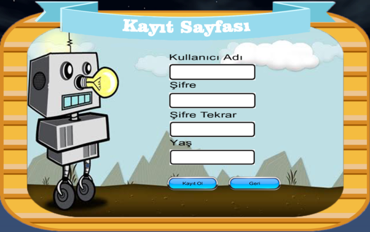
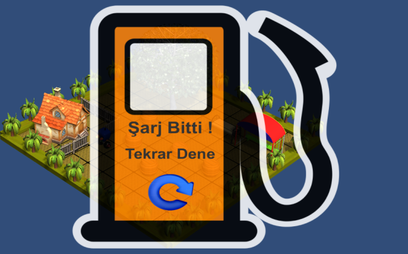
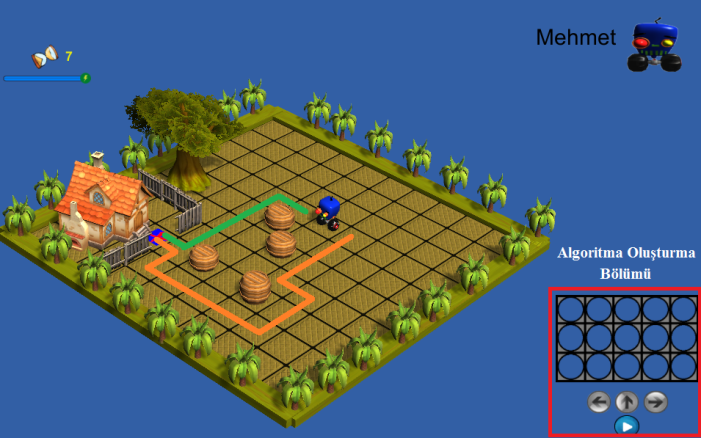

EvaÇocuk
========
Günümüz teknolojisinin geldiği noktada robotik ve programlama alanlarında yaşanan gelişmeler artık hayatımızın vazgeçilmez alanlarını oluşturmaya başlamıştır. 
Hızla hayatımıza giren bu teknolojilerin öğrenilmesi ve geliştirilmesi için çocuk yaşlarda eğitimlerinin verilmesi de büyük önem arz eden bir konudur. 
Bu çalışmada gezgin robotların öğrenilmesi için görsel programlama kullanarak etkileşimli ciddi oyunların geliştirilmesi üzerine bir çalışma yapılmıştır. 
Unity ortamında geliştirilen eğitici robotik oyun internet üzerinden küçük yaştaki kullanıcılara sunulmuştur. 
Oyun içerisindeki robot karakterin bulunduğu konumdan gideceği hedef noktasına, en kısa yoldan ve en kısa zamanda, 
görsel programlama kullanılarak ulaştırılması planlanmıştır. Bu sayede kullanıcının analitik düşünme, programlama ve 
problemlere çözüm getirebilme yeteneğinin geliştirilmesi hedeflenmiştir.

Bu çalışmada gezgin robotların öğrenilmesi için görsel programlama kullanarak etkileşimli ciddi oyunlar geliştirilmiştir.
Oyuna erişim http://www.evacocuk.com adresinden sağlanabilir. Geliştirme aşamasında olan oyun şu anda Internet Explorer tarayısıcında çalışmaktadır.

Oyuna giriş esnasında öncelikle şekildeki kullanıcı kayıt ekranından kullanıcı kaydı yapılmaktadır. 
Buradaki amaç sisteme kayıt olan kullanıcıların oyun skorlarının takibi ve buna bağlı olarak gösterdikleri gelişimin incelenmesidir. 
Ayrıca kullanıcılar arasında yapılan skor sıralamalarında yer almalarını sağlamaktır.

   
Kullanıcı kaydı yapılmış olan kullanıcılar, kullanıcı adı ve parolalarıyla oyuna giriş yapabilmektedir. 
Oyun içerisinde ise bir noktadan harekete başlayan robot karakter, hedeflenen varış yerine en kısa zamanda ve en az hareket sayısıyla ulaşmaya çalışmaktadır.    

Kullanıcıların oyun içerisindeki hareket sayıları, robot karakterin şarj durumuna bağlı olarak kısıtlanmıştır. 
Şarjın bitmesi durumunda Şekil 2’deki şarj bitti sayfası ekrana gelmekte ve kullanıcı oyunda başarısız sayılmaktadır.
   

Robotun başlangıçtan hedef noktasına kadar şekil 3’teki gibi kullanabileceği hedef noktasına ulaşan veya ulaşamayan birden fazla yol güzergâhı bulunmaktadır. 
Burada kullanıcıdan mümkün olan en kısa yolu tercih etmesi ve bunu yaparken de süreyi minimum seviyede tutması beklenmektedir. 
Uygulamada robot karakterin yol güzergâhını belirlemek için kullanılacak Şekil 3’de gösterilen bir algoritma oluşturma bölümü mevcuttur. 
Kullanıcıların oyun esnasında harcadıkları süreye, kullandıkları hareket sayısına ve algoritmalarını işletecek butonun kaç kere kullanıldığına bağlı olarak oyun puanı hesaplanmaktadır.

