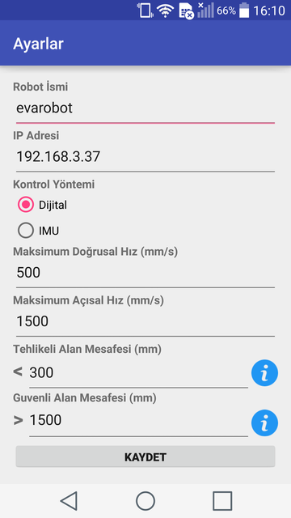
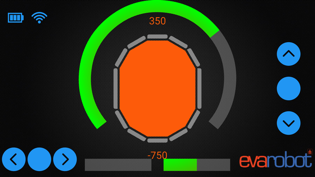

EvaMobil
========
Bu kısımda evarobot'un Android cihazlardan kontrolü için gelişitirilen EvaMobil isimli uygulama anlatıllmaktadır.
Uygulama Google Play üzerinden bu `linkten <https://play.google.com/store/apps/details?id=com.inovasyon.eva_mobil>`_ indirilebilir.

Uygulama ile ilgili ayarların yapılabildiği arayüz aşağıdaki resimde gösterilmektedir.
Bu arayüz üzerinden yapılabilen ayarlar;

- Robotun IP  adresi,
 
- Kontrol yöntemi,

- Maksimum doğrusal hız,

- Maksimum açısal hız,

- Tehlikeli alan mesafesi,

- Güvenli alan mesafesi parametreleri ayarlanabilmektedir.

   
   
evarobot'un kontrolü için açısal ve doğrusal hız değerlerinin üretildiği ekran aşağıdaki resimde gösterilmektedir.
Bu arayüz üzerinden yapılan ayarlara göre robota IMU ya da butonlar kullanılarak doğrusal ve açısal hız değerleri gönderilmektedir.
Ayarlar sayfasından belirlenen değerlere göre sensör verileri görselleştirilmektedir.

