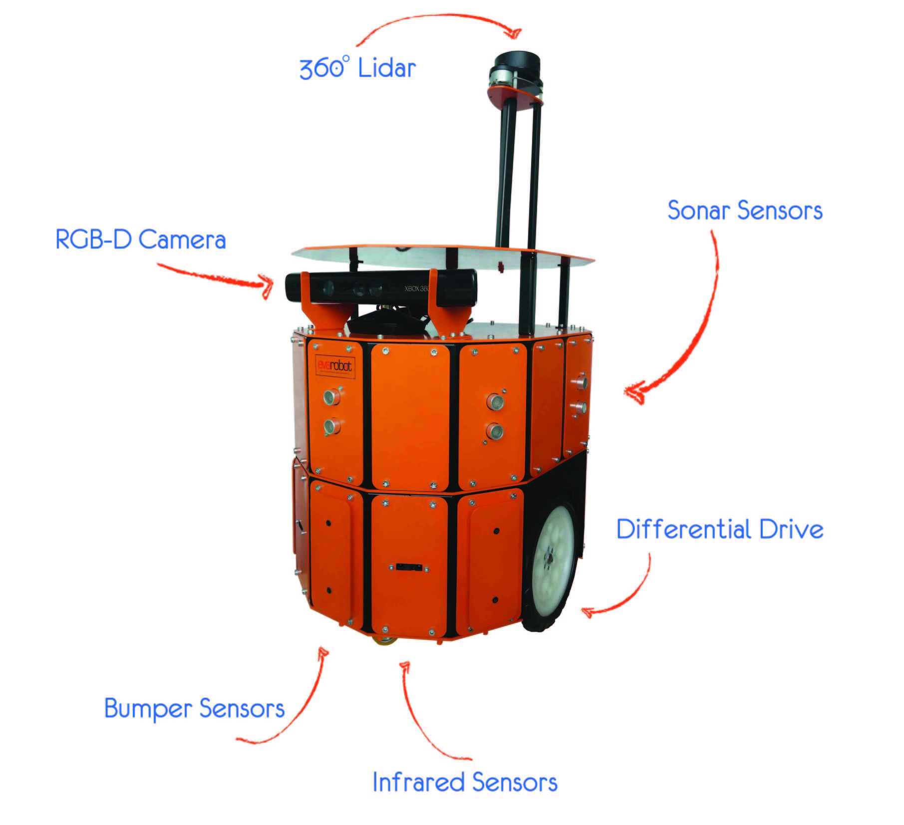
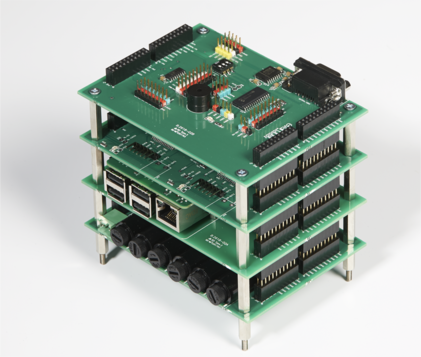
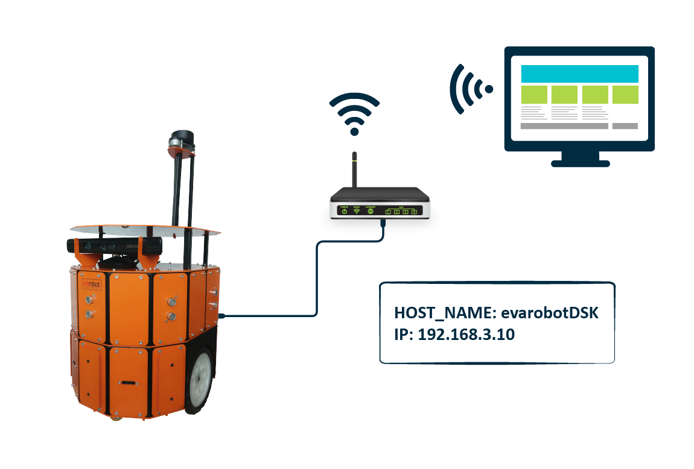
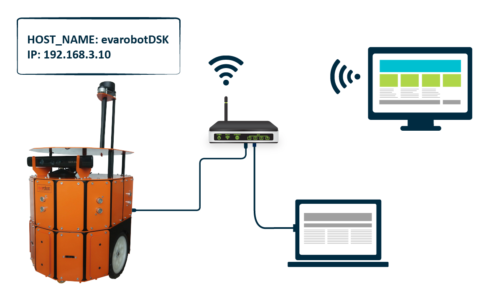

Giriş
=====
Bu kullanım klavuzu kullanıcıların evarobotu kolay ve hızlı bir şekilde
çalıştırması ve üzerinde geliştirme yapması için hazırlanmıştır. Robotlar 
üzerinde ROS yazılımı yüklüdür. ROS hakkında ayrıntılı bilgi için ros.org
sitesini ziyaret edebilirsiniz.

Başlamadan Önce
---------------

* **Geliştirme Araçları** 
 
 - evarobot'a bağlanmak için bir bilgisayar gereklidir. Robota bağlantı
   kablolu veya kablosuz olarak gerçekleştirilebilir.

* **Linux**
 
 - Linux; Unix ortamının üzerine kurulmuş, neredeyse tüm bilgisayarlar 
   için uygun olan, ücretsiz bir işletim sistemidir. Geliştirmeye başlamadan 
   önce Linux'ta kullanılan temel terminal komutlarının öğrenilmesi önerilir.
   Geliştirme uzak bilgisayardan ssh veya benzer bir araç ile sağlanabileceği
   gibi robota ekran, fare, klavye bağlanarakta gerçekleştirilebilir.

* **ROS ve evarobot**

 - evarobot yazılımı ROS tabanlıdır. evarobot ve ROS'un çalışma mantığını 
   anlayabilmek için http://wiki.ros.org/ROS/Tutorials adresindeki uygulamaları gerçekleştirebilirsiniz.

evarobot Tanıtım
----------------

Evarobot, mekaniği, donanımı ve yazılımı ile tamamen yerli üretim olarak 
İnovasyon Mühendislik tarafından geliştirilmiştir. Bu kılavuzda Evarobot'un 
özellikleri ve üzerinde çalışan donanım EKB(Elektronik Kontrol Birimi) 
hakkında bilgiler yer almaktadır.

* **evarobot Özellikleri**

 
 
Robot platformuna ait bilgiler aşağıdaki tabloda gösterilmektedir.

========================= ==========================================
Özellik                     Değer
========================= ==========================================
En x Boy x Yükseklik		335x425x760mm
Yerden Yükseklik			55mm
Ağırlık(Batarya Dahil)		13kg
Yük Taşıma Kapasitesi		10kg
Batarya Gerilimi			12V
Batarya Kapasitesi			2x7Ah
Sürüş						Diferansiyel, 2 Sürüş, 2 Sarhoş
Maksimum Hız				1.0m/s
Sürücü Tekerler				170mm, Dolma Teker
Gövde Sensör Kapasitesi		20 Adet
========================= ==========================================

Robot üzerinde yer alan sensörler ve sayıları değiştirilebilmektedir.
Aşağıdaki tabloda bir sensör konfigürasyonu gösterilmektedir.

====================== ============================================
Sensör İsmi            Adet	X Marka/Model
====================== ============================================
Sonar					7 X IM-SMO20
Kızılötesi				7 X Sharp GP2YOA21YK
Bumper					3 X IM-BMP10
Baş Açısı Referans		1 X Polulu MinIMU9
Enkoder					2 X 64 CPR
Derinlik Kamerası		1 X Microsoft Kinect
Lidar					1 X RPLidar 360
Lazer					1 X Hokuyo URG-04LX
====================== ============================================

* **Elektronik Kontrol Birimi (IM-EKB10)**
IM-EKB10 mobil robot uygulamaları için geliştirilmiş ROS (Robot Operating System) 
uyumlu kontrol kartıdır. Kart; IM-REG10, IM-DRV10, IM-ADP10 ve IM-SENS10 kartları 
olmak üzere 4 katlı yapıdadır. 4 katlı yapıda güç, motor sürücü, Raspberry Pi ve 
sensör katları yer alır. Değiştirilebilir katlı yapısı sayesinde farklı 
konfigürasyonlarda kullanıma uygundur. Robotik uygulamalarda sıklıkla kullanılan 
sensörler için güç ve sinyal girişleri bulunur. Kontrol için geliştirilen yazılım 
kütüphaneleri ve ROS paketleri açık kaynak kod olarak paylaşılmaktadır. Ayrıca 
paylaşılan açık kaynak kodlu kütüphaneler ile gerçekleştirilen farklı uygulamalar 
da yer almaktadır. Farklı düzeyde robotik uygulamaları için konfigüre edilebilir, 
kullanımı kolay ve geliştirilebilir yapısı ile çok yönlü bir kontrol kartıdır. 

   
Genel Özellikler

 - Besleme Gerilimi: 7 - 24V (Kullanılacak motor özelliklerine göre seçilebilir.)
 - Anahtarlamalı ve sigorta korumalı güç kartı
 - 40 pin güç ve sinyal standart dişi PCB pin bağlantıları
 - İki kanal motor sürücü
 - Raspberry Pi B+/2 uyumlu adaptör kartı
 - Raspberry Pi için ilave sayısal ve analog bağlantılar
 - ROS uyumlu açık kaynak kodlu yazılımlar
 - Açık kaynak kodlu kütüphaneler
 - Robotikte çok kullanılan sensörler için tasarlanmış sensör girişleri
 - Boyut : 85 x 115 x 90mm
 - Ağırlık : 470g

Güç Özellikleri

 - 5 adet anahtarlamalı regülator
 - Güç girişi ve regülatör çıkışları için LED göstergeleri
 - Standart dişi PCB pim çıkışları
 - Sigorta korumalı giriş/çıkış
 - Güç Çıkışı: 80W
 - (!) Güç özelliklerinin detayı için `IM-REG10 <http://www.evarobot.com/dokuman/20150826-IM-REG10.pdf>`_ regülatör kartını inceleyiniz. 

Motor Sürücü Özellikleri

 - Maksimum PWM Frekansı : 20 kHz
 - Motor yönleri için LED göstergeleri
 - Standart erkek 90º PCM pim çıkışları
 - Motorlar için ilave klemens bağlantıları
 - Dahili 5V regülator
 - Enkoder bağlantı arayüzü
 - Maksimum Çıkış Akımı : 30A
 - Sürekli Çıkış Akımı : 12A
 - (!) Motor sürücü özelliklerinin detayı için `IM-DRV10 <http://www.evarobot.com/dokuman/20150826-IM-DRV10.pdf>`_ iki kanallı motor sürücü kartını inceleyiniz. 

Sensör Kartı Özellikleri

 - 8 analog kanal (SPI)
 - 7 genel amaçlı sayısal kanal (I2C)
 - 3 ON/OFF sensör kanalı
 - 1 Buzzer (I2C)
 - 1 RGB LED (I2C)
 - 4 I2C bağlantısı
 - 1 Kullanıcı LED göstergesi
 - TTL - RS232 dönüştürücü
 - Standart erkek PCB pim çıkışları
 - (!) Sensör kartı özelliklerinin detayı için `IM-SENS10 <http://www.evarobot.com/dokuman/20150826-IM-SENS10.pdf>`_ kartını inceleyiniz. 
   
* **evarobot Simülasyon**

evarobot ile gerçek ortam üzerinde çalışmalar yapabilmenin yanında 3 boyutlu 
simülasyon ortamı kullanarak da araştırmalar yapılabilmektedir. İçerisinde 4 tane 
fizik motoru çalıştırabilen 3 boyutlu simülasyon ortamı olan Gazebo'da evarobot 
modeli hazır olarak sizi beklemektedir. Simülasyon ortamında Evarobot ile nasıl 
çalışabileceğinizi anlatan uygulamaları ilerleyen kılavuzlardan edinebilirsiniz.

* **evarobot Kullanım Alanları**

Evarobot birden fazla disiplinlerin uygulamaya yönelik çalışmalarında 
kullanılabilecek bir platformdur. Bunlara örnek olarak yapay zeka, görüntü 
işleme, kontrol gibi çalışma alanları verilebilir.

evarobot Kullanımı
------------------

evarobot ile bir çok farklı varyasyonlarda iletişime geçilerek çalışılabilmektedir. 
Bu kılavuzda başlangıç seviyesinde önerdiğimiz iki varyasyon üzerinde durulacaktır. 
Örnekte tekli robot ile çalışmak için ayarlamalar yapılmaktadır. Çoklu robotlar 
ile çalışmada detay almak için `sitemiz <http://www.inovasyonmuhendislik.com>`_ 
üzerinden iletişime geçebilirsiniz. evarobot üzerinde modem kullanarak uzaktan 
gözlemleme yapabilir veya robotu kontrol edebilirsiniz. 

Yüksek kapasitede işlemler yapmaya ihtiyaç duyulduğunda minipc ya da dizüstü 
bilgisayarınızı kullanabilirsiniz. 

