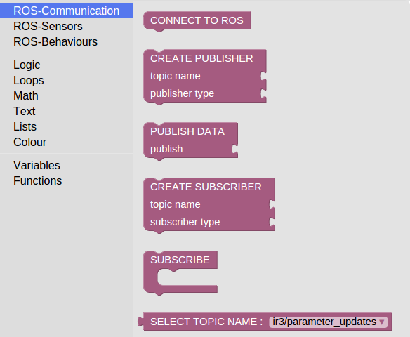

Görsel Programlama
==================

Görsel programlama kullanıcılara blokları bir araya getirerek kod yazma imkanı sağlayan sistemdir.
Bu kısımda evarobot için özelleştirilmiş `Google Blockly <https://developers.google.com/blockly/>`_ kullanılarak hazırlanan görsel programlama anlatılmaktadır.
Görsel programlama sayesinde daha önce hiç programlama ile uğraşmamış ya da programlamaya yeni başlayan kişiler rahatlıkla kodlama yapabilmektedir. 
Hazırlanan bloklar kullanılarak evarobot üzerinde bulunan sensör bilgileri okunabilmekte ve evarobot'a veri gönderilebilmektedir.
Hazırlanan paket `evablockly_ros <https://github.com/inomuh/evablockly_ros>`_ olarak adlandırılmıştır açık kaynak kodlu olarak paylaşılmaktadır.

Başlangıç
---------

evablockly_ros'u çalıştırmak için adımlar;

- Kodun indirilmesi: https://github.com/inomuh/evablockly_ros

- evapc_ros paketinin yüklenmesi: https://github.com/inomuh/evapc_ros (ROS indigo'nun indirilip kurulmuş olması gereklidir.)

- evarobot gazebo simulasyonun başlatılması: 

::

	> roslaunch evarobot_description evarobot.launch

- haberleşme için gerekli paketin başlatılması: 

::

	> roslaunch rosbridge_server rosbridge_websocket.launch

- start from terminal: 

::

	> rosrun rosapi rosapi_node

- indirilen kod içerisinden demos/fixed/index.html sayfasının açılması.

Kullanım
--------

evablockly_ros evarobot'u sürmek ve kontrol etmek için çeşitli görsel plokları içermektedir.
Hazırlanan bloklar başka robotlar içinde kullanılabilir fakat test edilmemiştir.
Bloklar ROS-Communication, ROS-Sensors ve ROS-Behaviours olmak üzere 3 kategoriye ayrılmıştır.

* **ROS-Communication**

Bu kategori ROS ile haberleşme ile ilgili blokları içermektedir. Blokların işlevleri aşağıda listelenmektedir.

 - CONNECT TO ROS: ROS sunucusuna bağlanmayı sağlar.

 - CREATE PUBLISHER: ROS sunucusuna veri göndermek için yayınlayıcı oluşturur. Mesajın ismi ve mesaj tipi bloğa paraemtre olarak girilir.

 - PUBLISH DATA: Oluşturulan yayınlayıcı kullanarak veri göndermeyi sağlar. Gönderilecek veri parametre olarak girilir.

 - CREATE SUBSCRIBER: ROS sunucusundan veri almak için abone oluşturur. Mesajın ismi ve mesaj tipi bloğa paraemtre olarak girilir.

 - SUBSCRIBE: Abone olunan veri geldiğinde yapılacak işler bu blok içerisinde tanımlanır.

   
   
* **ROS-Sensors**

Bu kategori sensör ile ilgili ROS bloklarını içermektedir. Blokların işlevleri aşağıda listelenmektedir.

 - GET RANGE VALUE:  sensor_msgs/Range mesaj tipinde yer alan verilerden seçileni döndürür.

 - GET ODOMETRY VALUE: nav_msgs/Odometry mesaj tipinde yer alan verilerden seçileni döndürür. 

 - GET BUMPER VALUE: im_msgs/Bumper mesaj tipinde yer alan verilerden seçileni döndürür.

 - GET CLOCK VALUE: rosgraph_msgs/Clock mesaj tipinde yer alan verilerden seçileni döndürür.

 - GET CUSTOM VALUE: Herhangi bir tipte abone olunan mesaj tipinde parametre olarak girilen veriyi döndürür.

 - CMD_VEL: geometry_msgs/Twist tipinden basılmak üzere hız verilerini oluşturur.

   

* **ROS-Behaviours**

Bu kategori davranış tabanlı ROS bloklarını içermektedir. Blokların işlevleri aşağıda listelenmektedir.

 - TELEOP: Bu blok klavye üzerindeki yön tuşlarını dinleyerek basılan tuşa göre robot hareketini gerçekleştirir. 
  Yukarı ok tuşu robotu ileriye hareket ettirir, 
  aşağı ok tuşu robotu geriye hareket ettirir, 
  sağ ok tuşu robotu sağa döndürür, 
  sol ok tuşu robotu sola döndürür, 
  boşluk tuşu robotu durdurur.

 - WANDER: Bu blok robotun üzerindeki sonar sensörü bilgilerini kullanarak etrafındaki engellere çarpmadan etrafta dolaşmasını sağlar. Eğer sensör değerleri belirlenen değerin altında ise robot başka bir yöne döner ve ilerlemeye  devam eder.

 - SET PID PARAMETERS: Bu blok robotun sağ ve sol tekerleri için pid parametrelerini ayarlar. Her iki teker içinde kp, kd, ki değerlerini parametre olarak alır.

   

Örnekler
--------

* **Sonar sensörüne abone olma**

Aşağıdaki şekilde sonar sensörüne nasıl abone olunacağı gösterilmektedir.
İlk olarak ROS sunucusuna bağlanma, ardından mesaj tipi ve ismi ile abone oluşturma, daha sonra okunan verileri gösterilmesi işlemleri gerçekleştirilmiştir.

   
* **Kızılötesi sensörüne abone olma**

Benzer şekilde kızılötesi sensörüne nasıl abone olunacağı gösterilmektedir.

* **Bumper sensörüne abone olma**

Benzer şekilde bumper sensörüne nasıl abone olunacağı gösterilmektedir.

* **Enkoder sensörüne abone olma**

Benzer şekilde enkoder sensörüne nasıl abone olunacağı gösterilmektedir.

* **Herhangi bir mesaja abone olma**

Benzer şekilde herhangi bir mesaja nasıl abone olunacağı gösterilmektedir.
Bu yöntemde abone olunacak mesaj ve mesaj tipi elle girilmektedir.

  
   
* **Mesaj Yayınlama**

Aşağıdaki şekilde cmd_vel topiğinden geometry_msgs/Twist tipinde mesajın nasıl yayınlanacağı gösterilmektedir.

