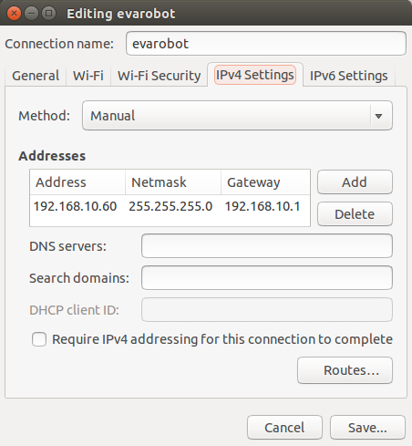

Hazırlık
========

evarobot Kurulumu
-----------------

Bu kısımda evarobot üzerine yapılması gereken kurulumlar anlatılmaktadır.
Evarobot'un içerisinde robotun kontrolü için kullanılan Elektronik Kontrol 
Birimi (IM-EKB10) bulunmaktadır. Bu kartın içerisinde Raspberry Pi 2 
çalışmaktadır. Yapılacak kurulumlar Raspberry Pi 2'ye takılacak olan 
SD kartın hazırlanmasına yöneliktir.

EKB içerinde 3.18.8-rt2-v7 linux kerneline sahip raspbian işletim sistemi 
çalışmaktadır. İşletim sistemi, evarobot sürücüleri ve ros paketlerinin 
kurulu olduğu image dosyası `linkten <https://mega.nz/#!uxwQFAxA!DCz7osfK9OhiiMDJezNMN8cZrKPskdhPz9y-zglntTU>`_ 
indirilebilir. Bu kısımda image dosyasının sd karta yazılması için yapılması 
gerekenlerden bahsedilecektir. Uygulamanın yapıldığı bilgisayar üzerinde 
Ubuntu 14.04 işletim sistemi bulunmaktadır. Robot ile gelen mikro SD karta 
sahip iseniz bu kısmı geçebilirsiniz. 

Image dosyasının son güncelleme tarihi: 04.09.2015.

Sıkıştırılmış evapi image dosyası indirildikten sonra unxz komutu ile açılır.

::

    > unxz  evapi-raspberrypi2-raspbian-rt-*.img.xz
    
Ardından, .img dosyası EKB üzerinde çalışacak Micro SD karta kopyalama işlemi yapılır. 
SD kartın hafızası minimum 4GB olmalıdır. Tavsiye edilen hafıza ise 16GB'tır. Örnek 
olarak verilen kodda çıkış dosyası olarak (of) /dev/sdb verilmiştir. Bu kısmı SD 
kartınız bilgisayarınızda hangi yolda açıldı ise onu yazmalısınız. Bu aşamada 
dikkatli olunması gerekmektedir. Aksi takdirde bilgisayardaki diğer harddiskleri 
biçimlendirme riski bulunmaktadır. 

Takılan SD kartın hangi yolda açıldığını öğrenmenin birçok yolu vardır. 

'Disks' isimli programı açarak resimdeki gibi öğrenebilirsiniz. 

 
:: 
  
   > sudo dd bs=512 if=evapi-raspberrypi2-raspbian-rt-*.img of=/dev/sdb
   
.img dosyasını sd karta 4GB'lık alan kaplamaktadır. Eğer 4GB'tan daha büyük 
bir SD kart kullandıysanız geriye kalan alan ayrılmamış olarak bulunacaktır. 
Ayrılmamış bölgeyi de kullanmak için yeniden boyutlandırma yapmanız gerekmektedir. 
Anlatımda gparted programını kullanacağız. Bu program bilgisayarınızda yüklü 
değil ise yüklemek için terminalde aşağıdaki kodu çalıştırmalısınız.

::  
 
   > sudo apt-get install gparted
   
Gparted programı açılıp sağ üst köşeden sd kart seçilir. Büyütülecek partition 
üzerinde işlem yapabilmek sağ tıklayarak "Unmount"a tıklayarak çıkartılır.

   
Resimdeki gibi partition üzerinde sağ tıklanarak resize seçilir. 

   
İstenilen büyüklük ayarlanır ve değişikliklerin uygulanması için 'Apply All Operations' butonuna tıklanır. 

Bu aşamadan sonra sd kart kullanıma hazır hale gelmektedir. Kullanım için sd kartı EKB'ye takabilirsiniz. 
İşletim sistemindeki 

Kullanıcı Adı: pi 

Şifre: 12345

Evarobot kurulumunu aşağıdaki videodan takip edebilirsiniz. 

.. raw:: html

	<iframe width="700" height="393" src="https://www.youtube.com/embed/L2YO6avBDPs" frameborder="0" allowfullscreen>
	</iframe>

Bilgisayar Kurulumu
-------------------
Bu kısımda bilgisayar üzerinden kontrol ve görselleştirme için gereken kurulumlar anlatılmaktadır.
Evarobot üzerindeki EKB'nin yazılımsal olarak görevi motorları sürmek, sonar, kızılötesi, 
enkoder, bumper gibi sensörleri okumaktır. Kısacası Evarobot'un kontrolü bu kart üzerinden 
gerçekleştirilebilmektedir. Fakat daha yüksek işletim gücüne ihtiyaç duyan algoritmalar veya 
sensörler kullanıldığı zamanlarda ya da Evarobot çalışırken anlık görselleştirme yapmak 
istendiğinde başka bir bilgisayar kullanmak gerekmektedir. Bu bilgisayar mini pc veya bir 
laptop olabilir. Bunların dışında Evarobot'u 3B simülasyon ortamı olan Gazebo'da da çalıştırmak 
için bu kurulumu yapmanız gerekmektedir. Evarobot ile birlikte çalıştırmak istediğiniz 
bilgisayara Ubuntu 14.04 işletim sistemini ve ROS Indigo'yu kurmuş olmanız gerekmektedir.

Bir sonraki adıma geçmeden önce `Installing and Configuring ROS Environment <http://wiki.ros.org/ROS/Tutorials/InstallingandConfiguringROSEnvironment>`_ isimli ROS 
dersini bilgisayarınızda tamamlamış olmanız gerekmektedir. Anlatım sırasında ROS 
workspace olarak catkin_ws klasör ismi kullanılacaktır. Eğer sizde bu workspace'ın 
adı farklı ise lütfen komutları kendi bilgisayarınıza göre değiştirerek kullanınız. 
Yukarıda bahsedilen ROS dersini başarıyla ve harfiyen uyguladıysanız aşağıdaki kodları 
hiç bir değişiklik yapmadan kullanabilirsiniz.  

Evarobot PC paketi kurulumu iki şekilde yapılabilmektedir. Bunlardan kaynak kodu 
ile kurulum tavsiye edilen yöntemdir. Çünkü en güncel hali kaynak kodu üzerinden 
indirildiğinde elde edilmektedir.

* **Debs ile Kurulum**

::  
 
   > sudo apt-get install ros-indigo-evapc-ros

* **Kaynak Kodu ile Kurulum**

Evarobot'un bağımlı olduğu paketler indirilir ve derlenir.

::
	
	> cd ~/catkin_ws/src

	# rplidar paketi indirilir.
	> git clone https://github.com/robopeak/rplidar_ros.git -b slam

	# teleop paketi indirilir.
	> sudo apt-get install ros-indigo-teleop-twist-keyboard

	# gazebo ros paketleri indirilir.
	> git clone https://github.com/ros-simulation/gazebo_ros_pkgs.git -b indigo-devel
	> git clone https://github.com/ros-controls/ros_control.git -b indigo-devel
	> git clone https://github.com/ros-controls/control_toolbox.git -b indigo-devel
	> git clone https://github.com/ros-controls/realtime_tools.git -b indigo-devel

	# hector gazebo modeli indirilir.
	> git clone https://github.com/tu-darmstadt-ros-pkg/hector_gazebo.git -b indigo-devel

	# ros navigasyon paketi indirilir.
	> sudo apt-get install ros-indigo-navigation

	# çoklu rosmaster çalıştırmak için gerekli paket indirilir.
	> git clone https://github.com/fkie/multimaster_fkie.git -b indigo-devel

	# indirilen paketler derlenir.
	> cd ~/catkin_ws
	> catkin_make
	
Evarobot PC paketi indirilir ve derlenir.

::

	> cd ~/catkin_ws/src

	# evarobot pc paketi indirilir.
	> git clone https://github.com/inomuh/evapc_ros.git -b indigo-devel

Evarobot simulasyon ortamını kurmak için evarobot_simulation paketinin indirilmesi gerekmektedir.
İlgili bilgisayarda simulasyon ortamını kurmadıysanız bu adımı geçebilirsiniz.

::

	> git clone https://github.com/inomuh/evarobot_simulator.git -b indigo-devel
	
	
Indirilen paketler derlenir.

::

	> cd ~/catkin_ws
	> catkin_make

Ağ Ayarları
-----------
Bu kısımda evarobot ile bağlantı için yapılması gereken ağ ayarları anlatılmaktadır.
Ağ ayarları, bilgisayar ve evarobot için olmak üzere iki kategori altında toplanmıştır.

* **Bilgisayar için Ağ Ayarları**

Evarobot'a üzerinde bulunan modem sayesinde kablosuz olarak bağlanmak mümkündür. 
Takip eden bölümde bağlanmak istediğiniz PC'nin ağ ayarlarını yapmak için yapmanız 
gerekenler anlatılacaktır. Anlatım sırasında kullanılacak PC üzerinde Ubuntu 14.04 
işletim sistemi çalışmaktadır ve ROS versiyonu olarak Indigo kullanılmaktadır.

Bilgisayarınızı evarobot üzerinde çalıştıracak iseniz ethernet kablosu ile bağlanmanız tavsiye edilir.

Evarobot'a bağlanmak için SSH kullanılacaktır.
Bilgisayarınıza kurmak için terminalde aşağıdaki kodu çalıştırmalısınız.

::

	> sudo apt-get install ssh ssh-contact-service ssh-contact-client
	
Ağ ayarlarını yaparken bilgisayarınızın adını bilmek gerekmektedir. 
Aşağıdaki kodu terminalde çalıştırdığınızda bilgisayarınızın adını öğrenebilirsiniz.

::

	> hostname

Resimde de gördüğünüz gibi örneğimizde kullanacağımız bilgisayarın hostname'i evarobotserver. 
Uygulamada <hostname> yazan yere biz evarobotserver yazacağız. Sizde kendi hostname'inizi yazmanız gerekmektedir.

bashrc isimli dosyanın içerisinde ROS_HOSTNAME ve ROS_MASTER_URI değişkenlerini tanımlamamız gerekmedir. 
Bunun için gedit editörü ile ilgili dosyayı açıyoruz.

::

	> gedit ~/.bashrc
	
Açılan editörde en alltaki satıra kendi hostname'inizi yazmalı ve kaydederek editörü kapatmalısınız.

::

	export ROS_HOSTNAME=<hostname>
	export ROS_MASTER_URI=http://<hostname>:11311
	
Uygulamada kullanıdığımız bilgisayar için aşağıdaki gibi ekleme yapıyoruz.

::

	export ROS_HOSTNAME=evarobotserver
	export ROS_MASTER_URI=http://evarobotserver:11311

bashrc içerisinde herhangi bir değişiklik yapıldığında terminalde değişikliklerin uygulanması 
için açık terminalleri kapatıp yeniden açmalı ya da açık olan her terminalde aşağıdaki kodun çalıştırılması gerekmektedir.

::

	> bash

ROS değişkenlerini tanımladıktan sonra, host isimlerini ip adresleri ile ilişkilendireceğiz. 
Bunun için aşağıdaki gibi super kullanıcı olarak 'hosts' isimli dosyayı açıyoruz.

::

	> sudo gedit /etc/hosts

gedit editörü ile açtığımız 'hosts' dosyası içerisine Evarobot ve kendi bilgisayarımız için ip 
ve hostname bilgilerini giriyoruz. Burada dikkat edilmesi gereken konu, aynı ip birden fazla hostname'e atanmamalıdır.

::

	192.168.10.60 <hostname>
	192.168.10.10 evarobot

Örnekte kullandığımız bilgisayar için aşağıdaki gibi ekleme yaptık. 
Sizde kendi bilgisayarınızın hostname'ine uygun olarak düzeltme yapmalısınız.

::

	192.168.10.60 evarobotserver
	192.168.10.10 evarobot

evarobot ile bilgisayar arasında zaman eşitlemesinin yapılması gerekmektedir. 
Bunun için bilgisayarı ntp server olarak ayarlayacağız. 
Böylece, evarobot bilgisayara göre saatini ayarlayacaktır.

Ntp'nin indirilmesi için aşağıdaki kodu terminalde çalıştırıyoruz.

::
	
	> sudo apt-get install ntp

NTP ayarlarını yapmak için 'ntp.conf' dosyası açılır.

::

	> sudo gedit /etc/ntp.conf

Editörde 23. satıra aşağıdaki satırlar eklenir.

::

	server 127.127.1.0
	server 127.127.1.0 stratum 10

52. satıra ise aşadaki satırlara eklenir ve dosya kaydedilerek kapatılır.

::

	broadcast evarobot

Bilgisayar bir ağda client gibi çalışarak internetten saatini güncellerken, 
evarobot_wifi ağına girdiğinde ntp sunucu gibi çalışması için yeniden başlatmak gerekmektedir. 
Bu sebepten dolayı, evarobot_wifi isimli ağa her girildiğinde aşağıdaki kod terminalde 
çalıştırılarak ntp sunucunun yeniden başlatılması gerekmektedir.

::

	> sudo /etc/init.d/ntp restart

NTP ağındaki bilgisayarlar hakkında bilgi almak için aşağıdaki kod kullanılabilir.

::

	> ntpq --numeric --peers

evarobot_wifi ağı için ip ayarlarının yapılması

Bu kısımda evarobot_wifi ağından 192.168.10.60 ip'sini statik olarak almak için ayarlar yapacağız. 
Evarobot'a güç verdiğinizde bir kaç dakika içerisinde evarobot_wifi isimli ağı görebilirsiniz. 

Modem bilgileri: 

SSID: evarobot

Şifre: inomuh2015 

Aşağıdaki resimlerdeki 'evarobot' isimli ağa girilir. 

Ağdan şu anda dhcp tarafından otomatik bir ip atandı. Aşağıdaki resimlerdeki gibi 
'Edit Connections..'a tıklandığında açılan ekran evarobot_wifi seçilerek 'Edit' butonuna basılır. 

   
Açılan ekranda 'IPv4 Settings' sekmesi altında 'Method' Manual seçilerek 
resimdeki gibi adresler eklenir. Address: 192.168.10.60 Netmask: 255.255.255.0 Gateway: 192.168.10.1 

Yeni girilen ayarların aktif olması için resimdeki gibi Wifi Enable ve ardından Disable edilir. Daha sonra evarobot_wifi ağına girilir. 

   

Eğer ayarlamalar hatasız bir şekilde yapıldı ise terminalde aşağıdaki kod çalıştırıldığında
resimdeki gibi bilgisayarın 192.168.10.60 no ip'yi almış olması beklenmektedir.

::

	> ifconfig

Böylece bilgisayarınızın Evarobot ile sorunsuz haberleşebilmesi için, 
bilgisayar tarafında yapılması gerekli olan ayarlamaları yapmış bulunmaktasınız.

* **evarobot için Ağ Ayarları**

Evarobot ağ ayarlarını yapmadan önce Bilgisayar Ağ Ayarlarını yapmış olmasınız.

evarobot ağına statik ip ile bağlandıktan sonra, ssh ile Evarobot'a bağlanılır. (Şifre: 12345)
   
::

	> ssh pi@evarobot
	
Evarobot içerisindeki 'hosts' isimli dosyaya kendi bilgisayarımızın adını ve IP'sini 
eklemek için açıyoruz. Evarobot'a ssh ile bağlandığımız için içeride görsel bir şey 
çalıştırmak mümküm değildir. Bu yüzden gedit editörü yerine nano editörünü kullanıyoruz.

::

	> sudo nano /etc/hosts

Aşağıdaki gibi eklemeye yapacağız. Hostname yerine bilgisayarımızın hostname'i yazacağız.

::

	192.168.10.60 <hostname>

Örnek için kullandığımız bilgisayar için aşağıdaki gibi bir giriş yapıyoruz.

::

	192.168.10.60 evarobotserver

Kaydederek çıkmak için Ctrl + X tuş kombinasyonunu kullanıyoruz. Kaydetmek 
isteyip istemediğimizi soracak Y tuşuna basıyoruz. Ardından dosya isminde değişiklik yapmadan Enter'a basıyoruz.

Evarobot'un bilgisayarınız ile zaman eşitlemesi yapması için bilgisayar tarafında yapılan ayarlara benzer bir ayarlama da Evarobot tarafında yapmak gerekmektedir. 
Bunun için nano editörü ile ntp.conf dosyasını açıyoruz.

::

	> sudo nano /etc/ntp.conf

Açılan dosyada 22. satıra aşağıdaki kodu, hostname olarak bilgisayarınızın adı gelecek şekilde 
düzenleme yaparak eklemeniz gerekmektedir. nano editöründe imlecin hangi satırda olduğunu 
öğrenmek için Ctrl+C tuş kombinasyonunu kullanabilirsiniz.

::

	server <hostname> iburst

Örneğimiz için biz aşağıdaki kodu yapıştırdık. Sizde kendinize göre düzenlemeyi unutmayınız.

::

	server evarobotserver iburst

Dosyanın en sonundaki iki satırın başında # işaretlerini siliniz.

::

	#disable auth
	#broadcastclient

Son iki satırıda aşağıdaki formata getirdikten sonra Ctrl+X ile değişiklikleri kaydederek çıkalım.

::

	disable auth
	broadcastclient

Aşağıdaki kodu teminalde çalıştırarak ntp'yi yeniden başlatmalısınız.

::

	> sudo /etc/init.d/ntp restart

Böylece Evarobot Ağ Ayarlarını tamamlamış bulunmaktayız.

Donanımsal Kurulum Talimatları
------------------------------

..... İçerik Hazırlanıyor ......
