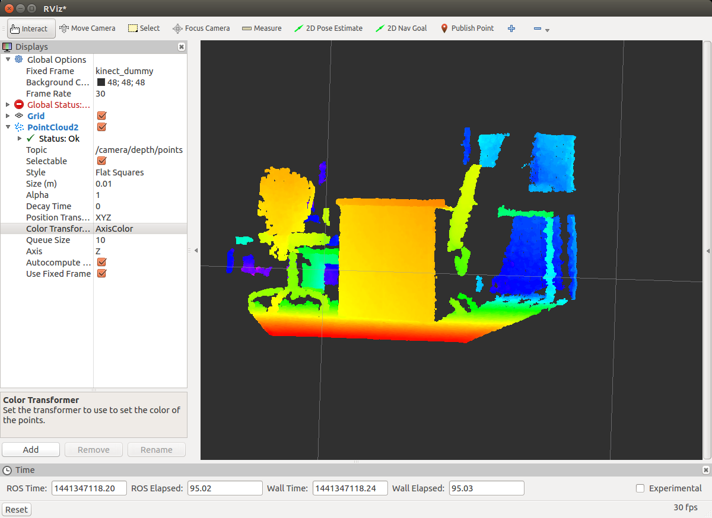

Kinect
``````

Bu kısımda Kinect verisinin kullanılması ve görselleştirilmesi anlatılmaktadır.
Kinect'i çalıştırmak için OpenNI ve NITE kurmamız gerekmektedir.
İlgili yazılımları kurmadan önce bağlı oldukları kütüphaneleri indiriyoruz.

::

	> sudo apt-get install g++ python libusb-1.0-0-dev freeglut3-dev
	> sudo apt-get install doxygen graphviz mono-complete
	> sudo apt-get install openjdk-7-jdk

OpenNI kurmak için aşağıdaki işlemleri sırası ile yapmamız gerekmektedir.

::

	> git clone https://github.com/OpenNI/OpenNI.git
	> cd OpenNI
	> git checkout Unstable-1.5.4.0
	> cd Platform/Linux/CreateRedist
	> sudo chmod +x RedistMaker
	> ./RedistMaker
	> cd ../Redist/OpenNI-Bin-Dev-Linux-[xxx]
	> sudo ./install.sh

Kinect donanımı ile haberleşmeyi sağlamak için ise NITE'i kuruyoruz.

::

	> git clone git://github.com/ph4m/SensorKinect.git
	> cd SensorKinect/Platform/Linux/CreateRedist
	> sudo chmod +x RedistMaker
	> ./RedistMaker
	> cd ../Redist/Sensor-Bin-Linux-x64-v*
	> sudo ./install.sh

Kinect'ten gelen verileri ROS ortamına aktarmak için kullanabileceğimiz launch dosyasını indirmemiz gerekmektedir. 
openni ve freenect olmak üzere iki tane launch dosyası bulunmaktadır. 
Bunlardan bir tanesini kurarak çalıştırmamız yeterlidir. 
Fakat bazı bilgisayarlarda openni.launch çalışmadığı için ikisininde kurulumu va çalıştırılmasını ders kapsamında anlatacağız.

Openni kurulumu aşağıdaki gibidir.

::

	> sudo apt-get install ros-indigo-openni-camera ros-indigo-openni-launch

Çalıştırmak için ise aşağıdaki gibi launch dosyasını çalıştırmamız yeterlidir.

::

	> roslaunch openni_launch openni.launch

Kinect, Evarobot ile birlikte çalıştırıldığında koordinat dönüşümlerinde hata olmaması için derinlik frame'i olarak kinect_dummy'nin argumanlarda verilmesi gerekmektedir.

::

	> roslaunch openni_launch openni.launch depth_frame_id:=kinect_dummy

Openni launch dosyasını açmada problem yaşarsak, aşağıdaki gibi freenect kurabiliriz.

::

	> sudo apt-get install libfreenect-dev ros-indigo-freenect-launch

freeenect'in çalıştırılmak için ise aşağıdaki gibi launch dosyasını çalıştırmamız yeterlidir.

::

	> roslaunch freenect_launch freenect.launch

Kinect verisini görselleştirmek için rviz'i kullabiliriz.

::

	> rosrun rviz rviz




