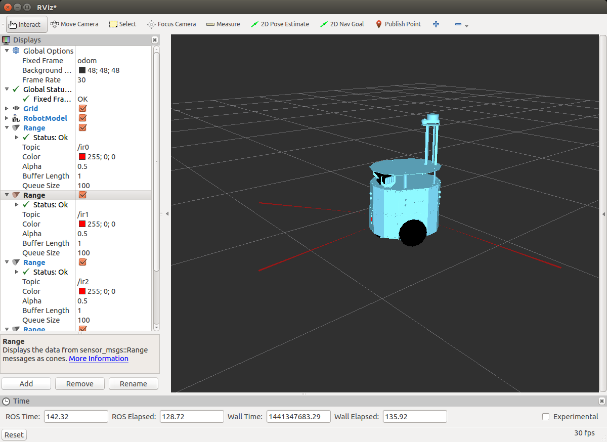

Kızılötesi
``````````

Bu kısımda evarobot üzerindeki kızılötesi sensörlerinin nasıl kullanılacağı anlatılmaktadır.

Kızılötesini Çalıştırma
~~~~~~~~~~~~~~~~~~~~~~~

Evarobot üzerindeki kızılötesi sensörleri çalıştırmadan önce Evarobot'a ssh ile bağlanılır.

::

	# evarobot
	> ssh pi@evarobot
	> sudo -s

Kızılötesi sensörlerini çalıştırmak için aşağıdaki kodu terminalde çalıştırmak yeterli olacaktır. 
evarobot_infrared isimli launch dosyası kızılötesi sensörleri çalıştırmaktadır. 
Launch dosyasının aldığı parametreler hakkında bilgi almak için `evarobot_infrared <http://wiki.ros.org/Robots/evarobot/tr/Tutorials/indigo/Infrared>`_ sayfasını kullanabilirsiniz.

::

	# evarobot
	> roslaunch evarobot_infrared evarobot_infrared.launch

Bilgisayar ile Evarobot'un konuşabilmesi için multimaster_fkie paketinde keşif ve senkronizasyon için kullanılan iki düğümü çalıştırmamız gerekmektedir.

::

	# evarobot
	> roslaunch evarobot_start master_discovery.launch

::

	# evarobot
	> roslaunch evarobot_start master_sync.launch

Kızılötesi Sensörlerini Terminalden Okuma
~~~~~~~~~~~~~~~~~~~~~~~~~~~~~~~~~~~~~~~~~

Bilgisayar tarafında terminalden kızılötesi sensörlerini okumak için senkronizasyon düğümlerini çalıştırmak gerekmektedir.

::

	# pc
	> roslaunch evapc_start sync.launch

Başka bir terminalde rostopic komutu ile kızılötesi verisi okunabilir. 
Varsayılan ayarlarda kullanılan topik ismi /sensor/ir<n> şeklindedir. 
n senörün numarasını belirtmektedir. 3 tane sensör kullanığı örneği üzerinden 
bakarsak /sensor/ir0, /sensor/ir1, /sensor/ir2 isimli topiklerden veriler okunabilecektir. 
Örnek olarak 0 nolu sensörün verisini okumak için aşağıdaki kodu kullanıbiliriz.

::

	# pc
	> rostopic echo /sensor/ir0

Topik hakkında bilgi almak için ise aşağıdaki kod kullanılır.

::

	# pc
	> rostopic info /sensor/ir0


Kızılötesi Sensör için Basit Subscriber Yazma
~~~~~~~~~~~~~~~~~~~~~~~~~~~~~~~~~~~~~~~~~~~~~

Catkin çalışma alanında evarobot_infrared_subs adında paket oluşturulur.

::

	> cd ~/catkin_ws/src
	> catkin_create_pkg evarobot_infrared_subs sensor_msgs rospy roscpp

Oluşturulan paketin içerinde /src klasörü altında infrared_listener.cpp isminde c++ dosyası oluşturulur. 
Örnek kapsamında kızılötesi sensörlerden sadece 0 nolu sensörün okuması yapılacaktır.

::

	> cd ~/catkin_ws/src/evarobot_infrared_subs
	> mkdir -p ~/catkin_ws/src/evarobot_infrared_subs/src
	> cd src
	> gedit infrared_listener.cpp

infrared_listener.cpp dosyasının içerisine yazılacak kod aşağıda verilmektedir.

::

	#include "ros/ros.h"
	#include "sensor_msgs/Range.h"

	/**
	 * Bu örnekte evarobot üzerindeki kızılötesi sensörleri ROS sistemi üzerinden okuyan basit bir subscriber yapılmaktadır.
	 */

	/**
	 * Dinlenen topikten veri geldiğinde çalışacak callback fonksiyonudur.
	 * Bu örnekte, görevi gelen mesafe verileri ekrana yazdırmakdır.
	 */
	void chatterCallback(const sensor_msgs::Range::ConstPtr& msg)
	{
	  ROS_INFO("Infrared Seq: [%d]", msg->header.seq);
	  ROS_INFO("Infrared Range: [%f]", msg->range);
	}

	int main(int argc, char **argv)
	{
	  /**
	   * ROS ilklendiriliyor.
	   */
	  ros::init(argc, argv, "infrared_listener");

	  ros::NodeHandle n;

	  /**
	   * Subscriber tanımlanıyor.
	   * İlk parametre olarak dinlenecek topiğin adı, ardından bufferın büyüklüğü ve callback fonksiyonu tanımlanmaktadır.
	   */
	  ros::Subscriber sub = n.subscribe("sensor/ir0", 1000, chatterCallback);

	  ros::spin();

	  return 0;
	}

Kod bu `linten <_static/cpp_codes/kizilotesi.cpp>`_ indirilebilir.

Paket derlenirken yazdığımız cpp dosyasını derlemesi için CMakeLists.txt dosyasını aşağıdaki gibi düzenliyoruz.

::

	> cd ..
	> gedit CMakeLists.txt

::

	cmake_minimum_required(VERSION 2.8.3)
	project(evarobot_infrared_subs)

	find_package(catkin REQUIRED COMPONENTS
	  sensor_msgs
	  roscpp
	  rospy
	)

	catkin_package()

	include_directories(
	  ${catkin_INCLUDE_DIRS}
	)

	add_executable(infrared_listener src/infrared_listener.cpp)
	add_dependencies(infrared_listener sensor_msgs_generate_messages_cpp)
	 target_link_libraries(infrared_listener
	   ${catkin_LIBRARIES}
	)

Yazdığımız ROS paketini derliyoruz.

::

	> cd ~/catkin_ws/
	> catkin_make

Yazdığımız infrared_listener düğümünü aşağıdaki gibi çalıştırıldığında, okunan verilerin ekrana yazılması beklenmektedir.

::

	> rosrun evarobot_infrared_subs infrared_listener

Kızılötesi Sensör Verisini Görselleştirme
~~~~~~~~~~~~~~~~~~~~~~~~~~~~~~~~~~~~~~~~~

::

	> rosrun rviz rviz




