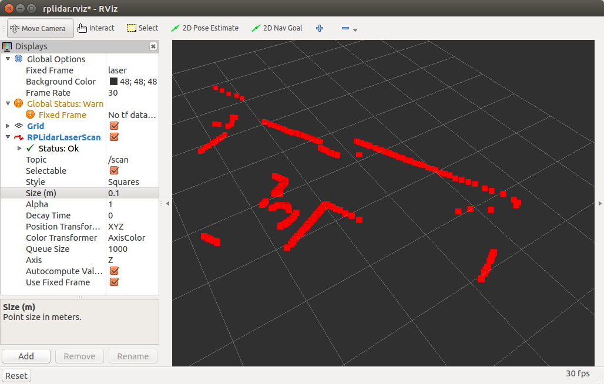

Lidar
`````
Bu kısımda evarobot üzerindeki RPLidar sensörünün nasıl kullanılacağı anlatılmaktadır.


Evarobot üzerindeki lidar sensör hakkında daha detaylı bilgi için `rplidar <http://wiki.ros.org/rplidar>`_ ros paketi incelenebilir. 
Ders kapsamında Türkçe kaynak oluşturması adına yüklemek ve çalıştırmak için yapılması gerekenlerden kısaca bahsedilecektir.

Paketin kaynak kodu indirilir ve derlenir.

::

	> cd ~/catkin_ws/src
	> git clone https://github.com/robopeak/rplidar_ros.git -b slam
	> cd ~/catkin_ws
	> catkin_make

Rplidar'ı çalıştırmak için usb sürücüsüne izin vermek gerekmektedir.

::

	> sudo chmod 777 /dev/ttyUSB0

Sadece rplidar'ı çalıştırmak için,

::

	> roslaunch rplidar_ros rplidar.launch

Rplidar ile birlikte rviz'de görselleştirme de yapmak için view_rplidar.launch dosyası kullanılabilir.


::

	> roslaunch rplidar_ros view_rplidar.launch





