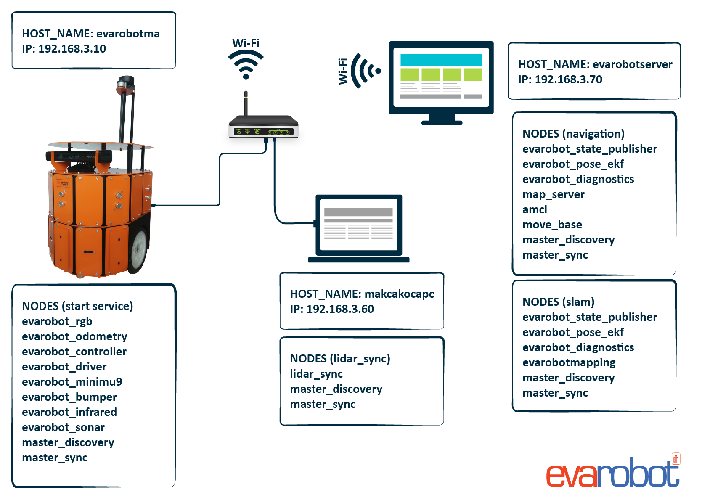

Uygulamalar: Otonom Evarobot Navigasyonu
````````````````````````````````````````

Bu kısımda daha önceden çıkartılmış haritada evarobot'un otonom robot navigasyonu anlatılmaktadır.


Sistem Tanıtımı
~~~~~~~~~~~~~~~




Navigasyon
~~~~~~~~~~

evarobot'u otonom hareket ettirmek için önceden ortamın haritasını çıkarmış olmanız gerekmektedir.
Gerçek ortamda, Evarobot'un otonom navigasyonu için aşağıdaki kodu terminalde çalıştırmanız yeterli olacaktır. 

Çalıştırılan launch dosyası; 

- Daha önceden kaydedilen haritayı, 

- amcl isimli konumlandırma düğümünü, 

- global ve lokal planlayıcıyı içeren move_base_real.launch dosyasını, 

- rviz'i çalıştırmaktadır.

::

	> roslaunch evarobot_navigation evarobot_navigation.launch 

evarobot'a otonom gitmesini istediğiniz noktayı bu örnek için rviz üzerinden verebilirsiniz. 
Bunun için rviz'de '2D Nav Goal' ile harita üzerinde işaretlemeniz yeterli olacaktır. 
rviz'i kullanmadan kendi yazacağınız düğüm ile hedef konumları evarobot'a vererek otonom hareket ettirebilirsiniz. 
Hedefleri move_base'e vermek için "/move_base/goal" isimli topikten hedef konum basmanız yeterli olacaktır.

Örnek uygulamayı videodan takip edebilirsiniz. 

.. raw:: html

	<iframe width="700" height="393" src="https://www.youtube.com/embed/d3kUAwNtQPo" frameborder="0" allowfullscreen>
	</iframe>
