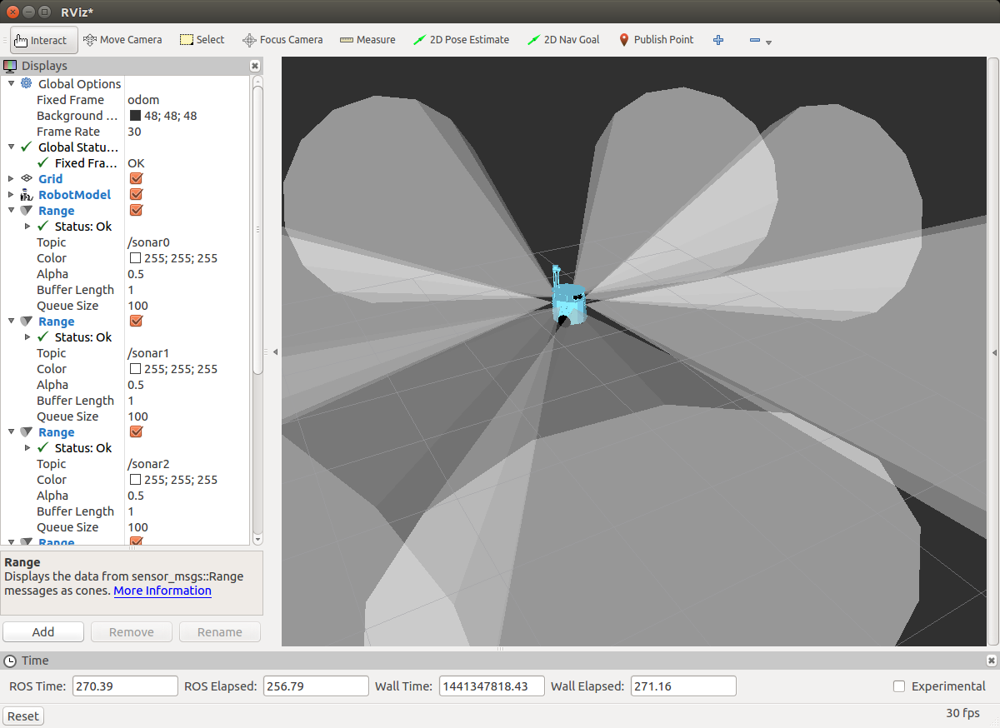

Sonar
`````

Bu kısımda evarobot üzerindeki sonar sensörlerinin nasıl kullanılacağı anlatılmaktadır.

Sonar Sensörünü Çalıştırma
~~~~~~~~~~~~~~~~~~~~~~~~~~

Evarobot üzerindeki sonarları çalıştırmadan önce Evarobot'a ssh ile bağlanılır.

::

	# evarobot
	> ssh pi@evarobotDSK
	> sudo -s

Sonar sensörlerini çalıştırmak için aşağıdaki kodu terminalde çalıştırmak yeterli olacaktır. 
evarobot_sonar isimli launch dosyası sonar sensörleri çalıştırmaktadır. 
Launch dosyasının aldığı parametreler hakkında bilgi almak için `evarobot_sonar <http://wiki.ros.org/evarobot_sonar>`_ sayfasını kullanabilirsiniz.

::

	# evarobot
	> roslaunch evarobot_sonar evarobot_sonar.launch

Bilgisayar ile Evarobot'un konuşabilmesi için multimaster_fkie paketinde keşif ve senkronizasyon için kullanılan iki düğümü çalıştırmamız gerekmektedir.

::

	# evarobot
	> roslaunch master_discovery_fkie master_discovery.launch

::

	# evarobot
	> roslaunch master_sync_fkie master_sync.launch


Sonar Sensörlerini Terminalden Okuma
~~~~~~~~~~~~~~~~~~~~~~~~~~~~~~~~~~~~

Bilgisayar tarafında terminalden sonar sensörlerini okumak için senkronizasyon düğümlerini çalıştırmak gerekmektedir.

::

	# pc
	> roslaunch master_discovery_fkie master_discovery.launch

::

	# pc
	> roslaunch master_sync_fkie master_sync.launch

Başka bir terminalde rostopic komutu ile sonar verisi okunabilir. 
Varsayılan ayarlarda kullanılan topik ismi /sensor/sonar<n> şeklindedir. 
n senörün numarasını belirtmektedir. 
3 tane sensör kullanığı örneği üzerinden bakarsak /sensor/sonar0, /sensor/sonar1, /sensor/sonar2 isimli topiklerden veriler okunabilecektir. 
Örnek olarak 0 nolu sensörün verisini okumak için aşağıdaki kodu kullanıbiliriz.

::

	# pc
	> rostopic echo /sensor/sonar0

Topik hakkında bilgi almak için ise aşağıdaki kod kullanılır.

::

	# pc
	> rostopic info /sensor/sonar0

Sonar Sensör icin Basit Subscriber Yazma
~~~~~~~~~~~~~~~~~~~~~~~~~~~~~~~~~~~~~~~~

Catkin çalışma alanında evarobot_sonar_subs adında paket oluşturulur.

::

	> cd ~/catkin_ws/src
	> catkin_create_pkg evarobot_sonar_subs sensor_msgs rospy roscpp

Oluşturulan paketin içerinde /src klasörü altında sonar_listener.cpp isminde c++ dosyası oluşturulur. 
Örnek kapsamında sonar sensörlerden sadece 0 nolu sensörün okuması yapılacaktır.

::

	> cd ~/catkin_ws/src/evarobot_sonar_subs
	> mkdir -p ~/catkin_ws/src/evarobot_sonar_subs/src
	> cd src
	> gedit sonar_listener.cpp

sonar_listener.cpp dosyasının içerisine yazılacak kod aşağıda verilmektedir.

::

	#include "ros/ros.h"
	#include "sensor_msgs/Range.h"

	/**
	 * Bu örnekte evarobot üzerindeki sonar sensörleri ROS sistemi üzerinden okuyan basit bir subscriber yapılmaktadır.
	 */

	/**
	 * Dinlenen topikten veri geldiğinde çalışacak callback fonksiyonudur.
	 * Bu örnekte, görevi gelen mesafe verileri ekrana yazdırmakdır.
	 */
	void chatterCallback(const sensor_msgs::Range::ConstPtr& msg)
	{
	  ROS_INFO("Sonar Seq: [%d]", msg->header.seq);
	  ROS_INFO("Sonar Range: [%f]", msg->range);
	}

	int main(int argc, char **argv)
	{
	  /**
	   * ROS ilklendiriliyor.
	   */
	  ros::init(argc, argv, "infrared_listener");

	  ros::NodeHandle n;

	  /**
	   * Subscriber tanımlanıyor.
	   * İlk parametre olarak dinlenecek topiğin adı, ardından bufferın büyüklüğü ve callback fonksiyonu tanımlanmaktadır.
	   */
	  ros::Subscriber sub = n.subscribe("sensor/sonar0", 1000, chatterCallback);

	  ros::spin();

	  return 0;
	}

Kod bu `linten <_static/cpp_codes/sonar.cpp>`_ indirilebilir.

Paket derlenirken yazdığımız cpp dosyasını derlemesi için CMakeLists.txt dosyasını aşağıdaki gibi düzenliyoruz.

::

	> cd ..
	> gedit CMakeLists.txt

::

	cmake_minimum_required(VERSION 2.8.3)
	project(evarobot_sonar_subs)

	find_package(catkin REQUIRED COMPONENTS
	  sensor_msgs
	  roscpp
	  rospy
	)

	catkin_package()

	include_directories(
	  ${catkin_INCLUDE_DIRS}
	)

	add_executable(sonar_listener src/sonar_listener.cpp)
	add_dependencies(sonar_listener sensor_msgs_generate_messages_cpp)
	 target_link_libraries(sonar_listener
	   ${catkin_LIBRARIES}
	)

Yazdığımız ROS paketini derliyoruz.

::

	> cd ~/catkin_ws/
	> catkin_make

Yazdığımız sonar_listener düğümünü aşağıdaki gibi çalıştırıldığında, okunan verilerin ekrana yazılması beklenmektedir.

::

	> rosrun evarobot_sonar_subs sonar_listener


Sonar Sensör Verisini Görselleştirme
~~~~~~~~~~~~~~~~~~~~~~~~~~~~~~~~~~~~

::

	> rosrun rviz rviz





