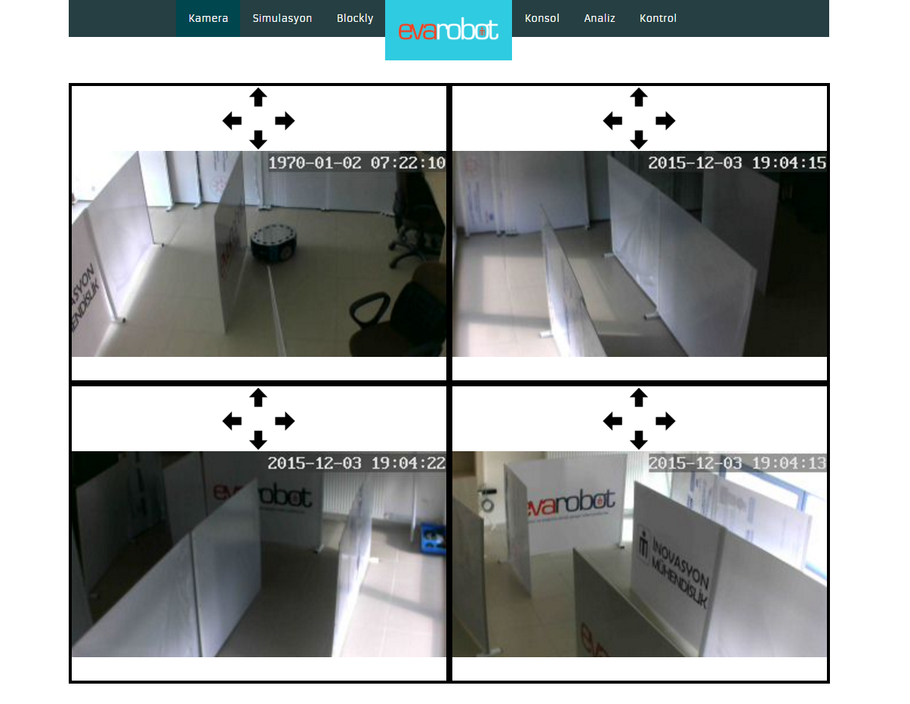
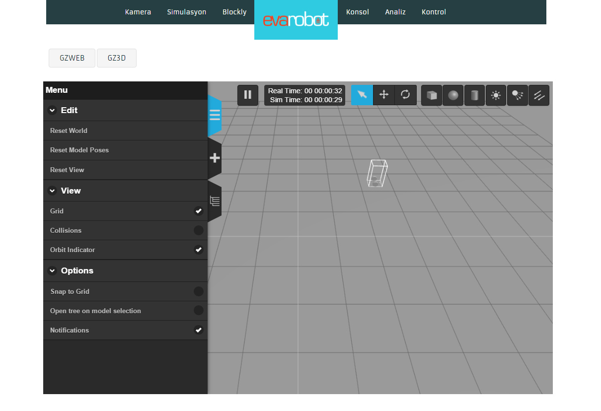
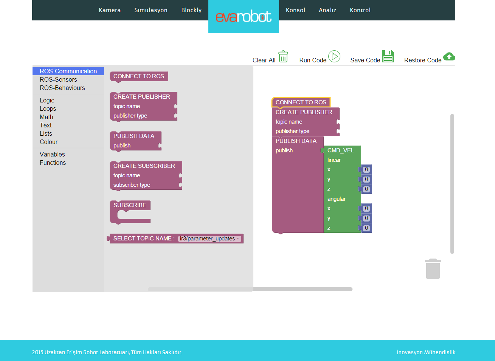
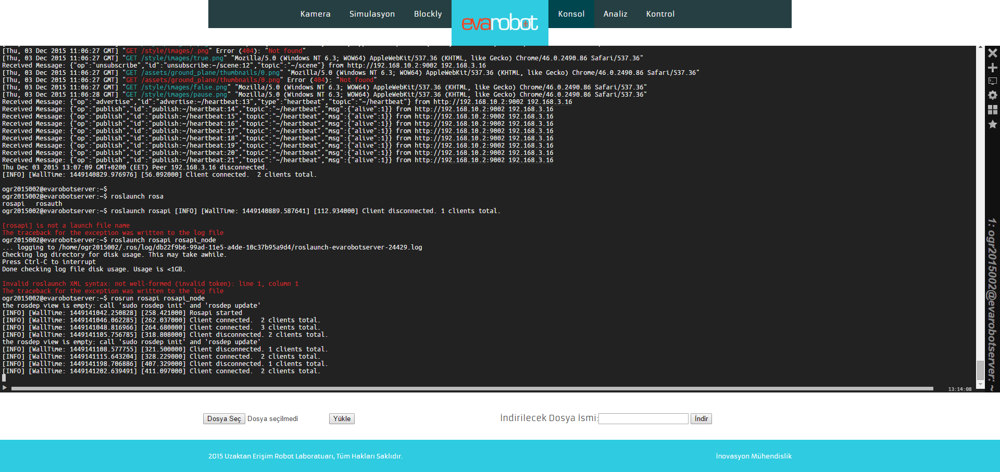
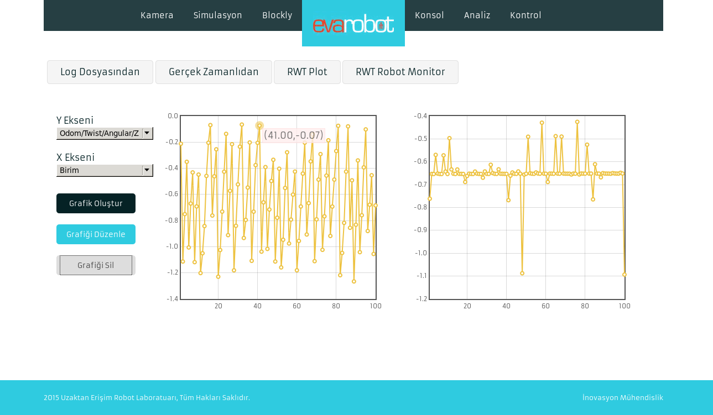
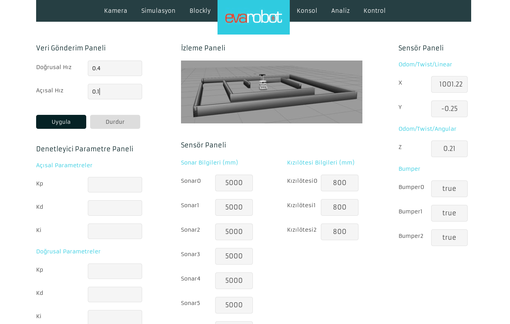

U-PLAT
======

Uzaktan Erişim Platformu evarobot'a veya evarobot simülasyonuna web üzerinden bağlanmayı,
deneyler yapmayı sağlayan sisteme verilen isimdir.

Sistem Kamera, Simülasyon, Blockly, Konsol, Analiz ve Kontrol olmak üzere 6 sayfadan oluşmaktadır.

* **Kamera**

Bu sayfadan evarobot'un açlıştığı ortam 4 farklı kamera ile izlenebilmektedir.
Kameraların bakış açısı arayüz üzerinden değiştirilebilmektedir.

* **Simülasyon**

Bu sayfada evarobot ve ortam simülasyonu gösterilmektedir.

* **Blockly**

Bu sayfa üzerinden görsel programlama ile evarobot kontrolü sağlanmaktadır.

* **Konsol**

Bu sayfa üzerinden U-PLAT sisteminin çalıştığı sunucu bilgisayara terminal bağlantısı sağlanmaktadır.

* **Analiz**

Bu sayfa üzerinden evarobot üzerindeki tüm sensör değerlerine ait zamana bağlı grafikler çizdirilebilmektedir.

* **Kontrol**

Bu sayfada evarobot üzerindeki tüm sensör değerleri gösterilmektedir. 
Aynı zamanda robota açısal ve doğrusal hızlar uygulanabilmektedir.

